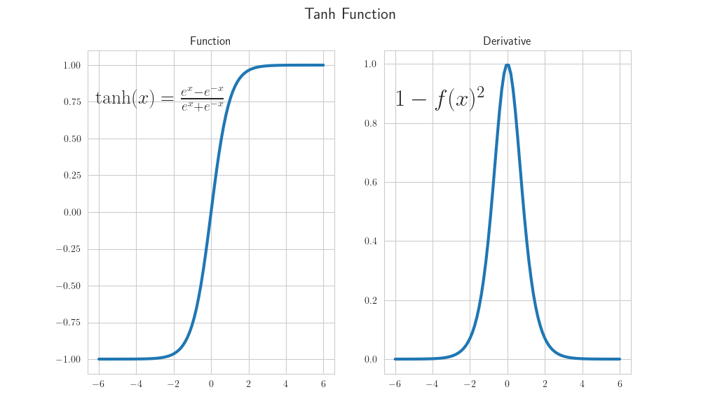
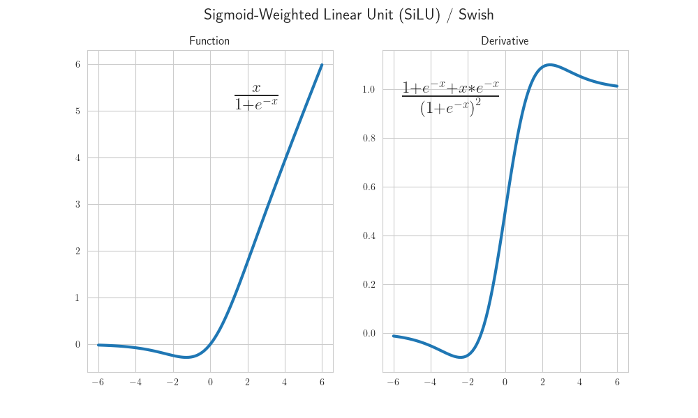
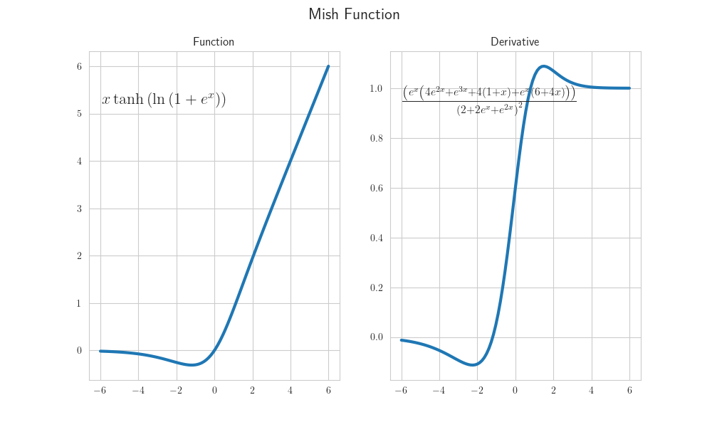

# Activation Functions

### Sigmoid Function

Function:

Derivative:

### Tanh Function

Function:

Derivative:

### Rectified Linear Unit (ReLU)

Function:

Derivative:

### Leaky ReLU

Function:

Derivative:

### Parametric ReLU

Function:

Derivative:

### Exponential Linear Unit (ELU)

Function:

Derivative:

### Scaled Exponential Linear Unit (SELU)

Function:

Derivative:

### Gaussian Error Linear Unit (GELU)

Function:

Derivative:

### Sigmoid-Weighted Linear Unit (SiLU) / Swish

Function:

Derivative:

### Softmax Function

Function:

### Softplus

Function:

Derivative:

### Mish

Function:

Derivative:

## Resources

- [https://en.wikipedia.org/wiki/Activation_function](https://en.wikipedia.org/wiki/Activation_function)
- [https://medium.com/the-theory-of-everything/understanding-activation-functions-in-neural-networks-9491262884e0](https://medium.com/the-theory-of-everything/understanding-activation-functions-in-neural-networks-9491262884e0)
- [https://www.v7labs.com/blog/neural-networks-activation-functions](https://www.v7labs.com/blog/neural-networks-activation-functions)
- [https://mlfromscratch.com/activation-functions-explained/#/](https://mlfromscratch.com/activation-functions-explained/#/)
- [https://ml-cheatsheet.readthedocs.io/en/latest/activation_functions.html](https://ml-cheatsheet.readthedocs.io/en/latest/activation_functions.html)