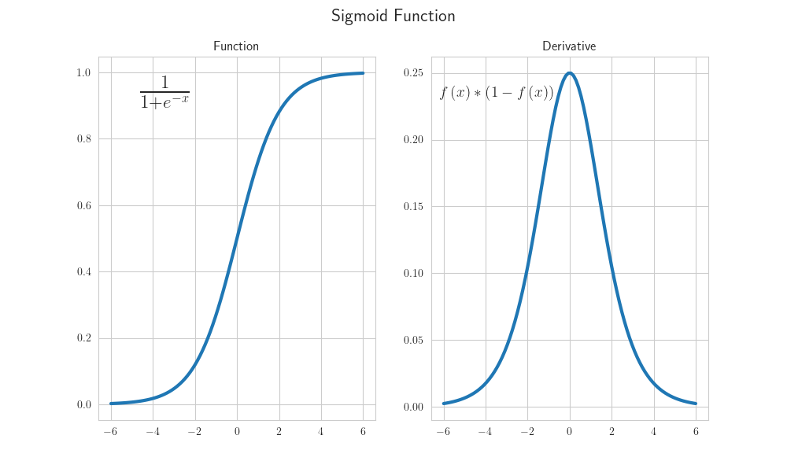
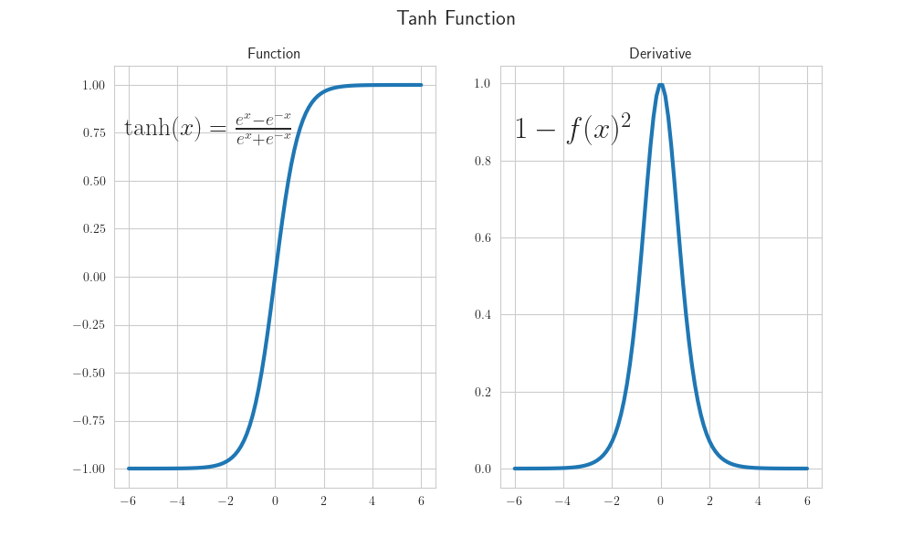
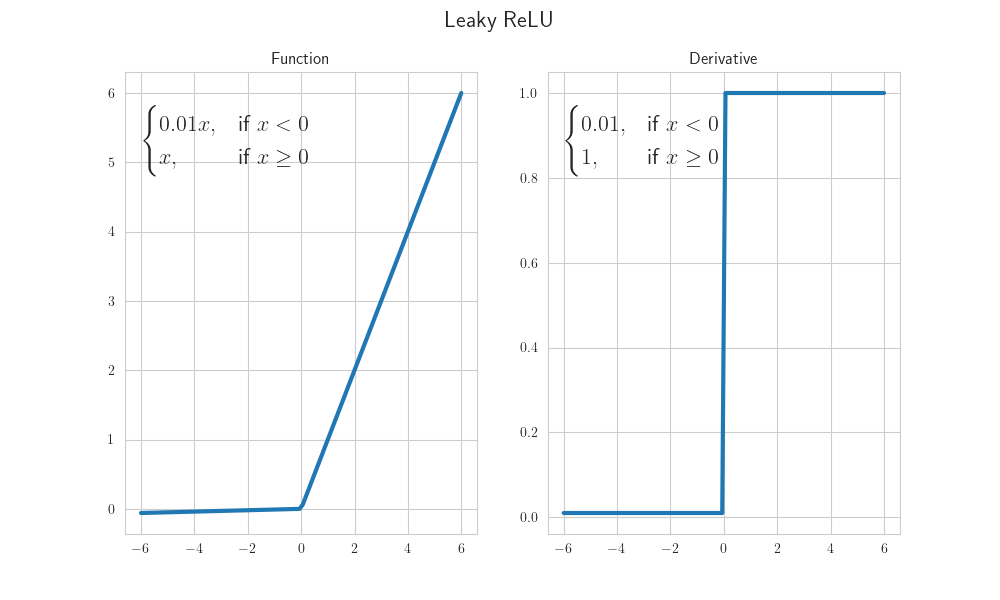
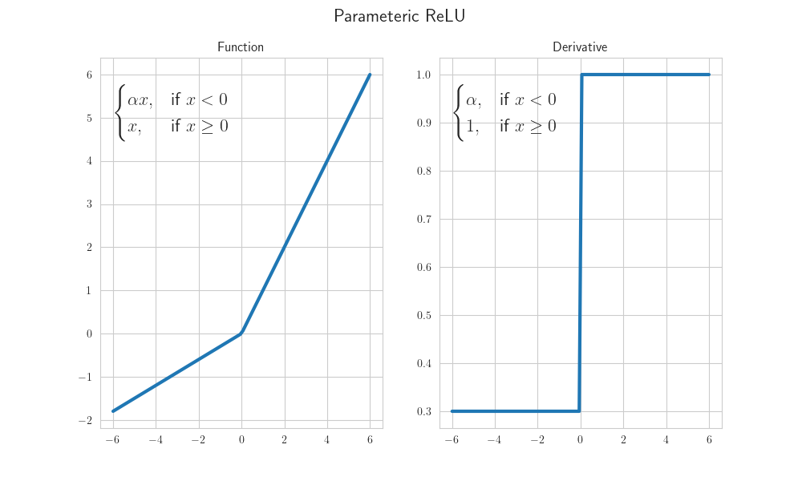
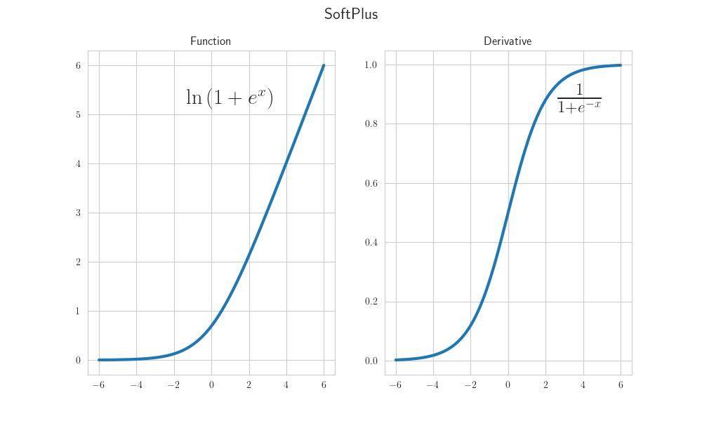
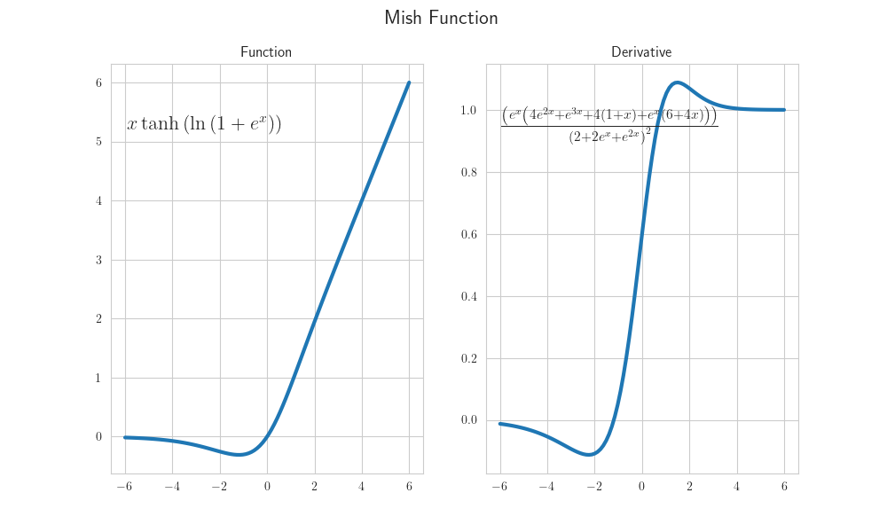

# Activation Functions

### Sigmoid Function

Function:

$$f\left(x\right)=\frac{1}{1+e^{-x}}$$

Derivative:

$$f'\left(x\right) = f\left(x\right) * \left(1 - f\left(x\right)\right)$$

### Tanh Function

Function:

$$f\left(x\right)=\tanh(x)={\frac {e^{x}-e^{-x}}{e^{x}+e^{-x}}}$$

Derivative:

$$f'\left(x\right) = 1-f(x)^{2}$$

### Rectified Linear Unit (ReLU)

.png)

Function:

$$f\left(x\right) = \begin{cases} 0,& \text{if } x \leq 0 \\ x,& \text{if } x > 0 \end{cases}$$

Derivative:

$$f'\left(x\right) = \begin{cases} 0 ,& \text{if } x < 0 \\ 1,& \text{if } x > 0 \\ \text{undefined},& \text{if } x = 0 \end{cases}$$

### Leaky ReLU

Function:

$$f\left(x\right) = \begin{cases} 0.01x,& \text{if } x < 0 \\ x,& \text{if } x \geq 0 \end{cases}$$

Derivative:

$$f'\left(x\right) = \begin{cases} 0.01 ,& \text{if } x < 0 \\ 1,& \text{if } x \geq 0 \end{cases}$$

### Parametric ReLU

Function:

$$f\left(x\right) = \begin{cases} \alpha x,& \text{if } x < 0 \\ x,& \text{if } x \geq 0 \end{cases}$$

Derivative:

$$f'\left(x\right) = \begin{cases} \alpha ,& \text{if } x < 0 \\ 1,& \text{if } x \geq 0 \end{cases}$$

### Exponential Linear Unit (ELU)

.png)

Function:

$$f\left(x\right) = \begin{cases} \alpha \left(e^x - 1 \right),& \text{if } x \leq 0 \\ x,& \text{if } x > 0 \end{cases}$$

Derivative:

$$f'\left(x\right) = \begin{cases} \alpha e^x,& \text{if } x < 0 \\ 1,& \text{if } x > 0 \\ 1,& \text{if } x = 0 \text{ and } \alpha=1 \end{cases}$$

### Scaled Exponential Linear Unit (SELU)

.png)

Function:

$$f\left(x\right) = \lambda \begin{cases} \alpha \left(e^x - 1 \right),& \text{if } x < 0 \\ x,& \text{if } x \geq 0 \end{cases} \\ \text{with parameters } \lambda = 1.0507 \text{ and } \alpha = 1.67326$$

Derivative:

$$f'\left(x\right) = \lambda \begin{cases} \alpha e^x,& \text{if } x < 0 \\ 1,& \text{if } x \geq 0 \end{cases}$$

### Gaussian Error Linear Unit (GELU)

.png)

Function:

$$f\left(x\right) = \frac{1}{2} x \left(1 + erf\left(\frac{x}{\sqrt{2}}\right)\right) = x * \Phi \left(x\right)$$

Derivative:

$$f'\left(x\right) = \Phi \left(x\right) + x \phi \left(x\right)$$

### Sigmoid-Weighted Linear Unit (SiLU) / Swish

_Swish.png)

Function:

$$f\left(x\right) = \frac{x}{1+e^{-x}}$$

Derivative:

$$f'\left(x\right) = \frac{1 + e^{-x} + x * e^{-x}}{\left(1 + e^{-x}\right)^2}$$

### Softmax Function

Function:

$$f\left(x\right) = \frac {e^{x_{i}}}{\sum _{j=1}^{J}e^{x_{j}}}$$

### Softplus

Function:

$$f\left(x\right) = \ln \left(1+e^{x}\right)$$

Derivative:

$$f'\left(x\right) = \frac{1}{1+e^{-x}}$$

### Mish

Function:

$$f\left(x\right) = x\tanh\left(\ln\left(1+e^{x}\right)\right)$$

Derivative:

$$f'\left(x\right) = \frac{\left(e^{x}\left(4e^{2x}+e^{3x}+4\left(1+x\right)+e^{x}\left(6+4x\right)\right)\right)}{\left(2+2e^{x}+e^{2x}\right)^{2}}$$

## Resources

- [https://en.wikipedia.org/wiki/Activation_function](https://en.wikipedia.org/wiki/Activation_function)
- [https://medium.com/the-theory-of-everything/understanding-activation-functions-in-neural-networks-9491262884e0](https://medium.com/the-theory-of-everything/understanding-activation-functions-in-neural-networks-9491262884e0)
- [https://www.v7labs.com/blog/neural-networks-activation-functions](https://www.v7labs.com/blog/neural-networks-activation-functions)
- [https://mlfromscratch.com/activation-functions-explained/#/](https://mlfromscratch.com/activation-functions-explained/#/)
- [https://ml-cheatsheet.readthedocs.io/en/latest/activation_functions.html](https://ml-cheatsheet.readthedocs.io/en/latest/activation_functions.html)