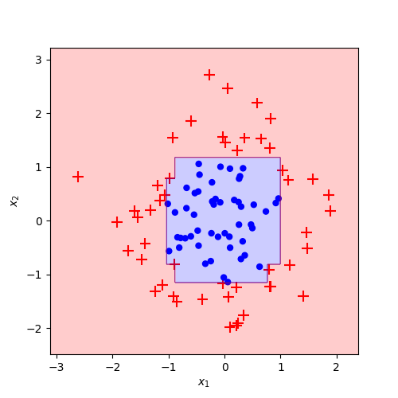
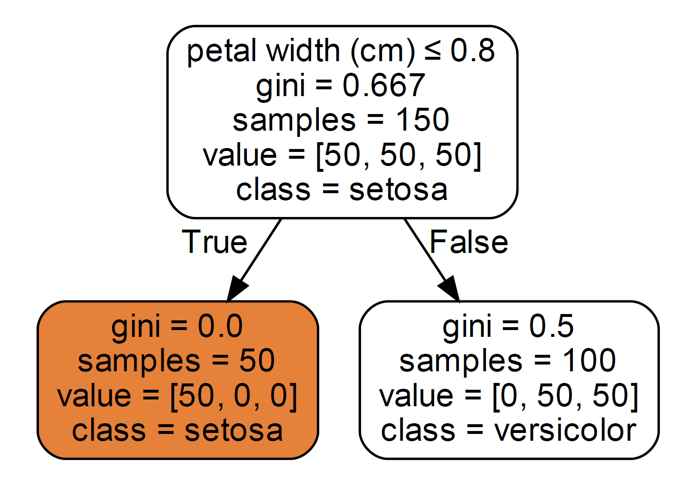
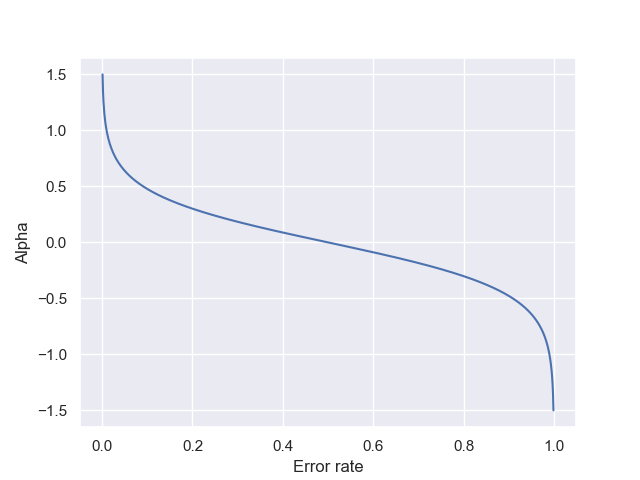
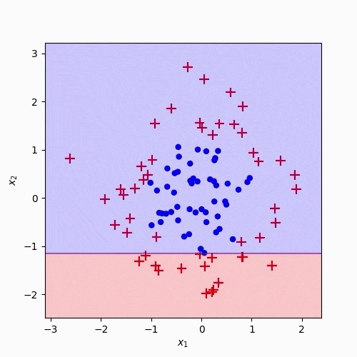

# AdaBoost - Adaptive Boosting

AdaBoost, short for **Ada**ptive [**Boost**ing](https://en.wikipedia.org/wiki/Boosting_(meta-algorithm)), of Freund and Schapire, was the first practical boosting algorithm and remains one of the most widely used and studied ones even today. Boosting is a general strategy for learning "strong models" by combining multiple simpler ones (weak models or weak learners).

A "weak learner" is a model that will do at least slightly better than chance. AdaBoost can be applied to any classification algorithm, but most often, it's used with **Decision Stumps** - Decision Trees with only one node and two leaves.

Decision Stumps alone are not an excellent way to make predictions. A full-grown decision tree combines the decisions from all features to predict the target value. A stump, on the other hand, can only use one feature to make predictions.

## How does the AdaBoost algorithm work?

1. Initialize sample weights uniformly as $w_i^1=\frac{1}{N}$.
2. For each iteration $t$:

**Step 1:** A weak learner (e.g. a decision stump) is trained on top of the weighted training data $X$. The weight of each sample $w_i$ indicates how important it is to classify the sample correctly.

**Step 2:** After training, the weak learner gets a weight based on its accuracy $\alpha_t = \frac{1}{2} \ln \Big( \frac{1-\epsilon_t}{\epsilon_t} \Big)$

**Step 3:** The weights of misclassified samples are updated $w_i^{(t+1)} = w_i^{(t)} \cdot e^{-\alpha^t y_i h_t(x_i)}$

**Step 4:** Renormalize weights so they sum up to 1 $\sum_{i=1}^n w_i^{(t+1)}=1$

3. Make predicts using a linear combination of the weak learners $H(x) = \text{sign} \Big(\sum_{t=1}^T \alpha_t h_t(x) \Big)$

## Code

- [Adaboost Python](code/adaboost.py)

## Resources

- [https://scikit-learn.org/stable/modules/ensemble.html#adaboost](https://scikit-learn.org/stable/modules/ensemble.html#adaboost)
- [https://www.youtube.com/watch?v=LsK-xG1cLYA](https://www.youtube.com/watch?v=LsK-xG1cLYA)
- [https://blog.paperspace.com/adaboost-optimizer/](https://blog.paperspace.com/adaboost-optimizer/)
- [https://en.wikipedia.org/wiki/AdaBoost](https://en.wikipedia.org/wiki/AdaBoost)
- [https://geoffruddock.com/adaboost-from-scratch-in-python/](https://geoffruddock.com/adaboost-from-scratch-in-python/)
- [https://www.cs.toronto.edu/~mbrubake/teaching/C11/Handouts/AdaBoost.pdf](https://www.cs.toronto.edu/~mbrubake/teaching/C11/Handouts/AdaBoost.pdf)
- [https://jeremykun.com/2015/05/18/boosting-census/](https://jeremykun.com/2015/05/18/boosting-census/)
- [https://ml-explained.com/blog/decision-tree-explained](https://ml-explained.com/blog/decision-tree-explained)