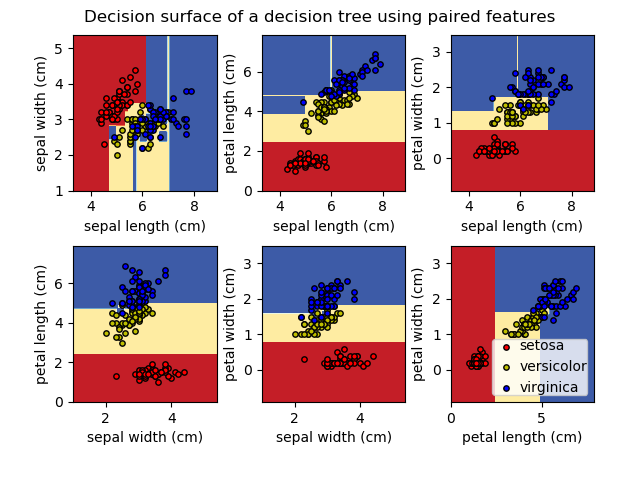

# Decision Trees


Decision Trees (DTs) are a non-parametric supervised learning method used for classification and regression. The goal is to create a model that predicts the value of a target variable by learning simple decision rules inferred from the data. DTs are highly interpretable, capable of achieving high accuracy for many tasks while requiring little data preparation. 

## Creating a decision tree – Recursive Binary Splitting

Growing a tree involves continuously splitting the data into subsets to minimize some cost function. At each step, all features are considered, and different split points are tried and tested using a cost function. The split with the lowest cost is then selected. The process gets repeated until some stopping point (mentioned later). This algorithm is recursive in nature as the groups formed after each split can be subdivided using the same strategy.

## Cost of a split

The cost of a split determines how good it is to split at that specific feature value. For regression cost functions like the sum of squared errors or the standard deviation are used.

<p align="center"></p>

<p align="center"></p>

For classification the Gini Index is used:

<p align="center"></p>

Where J is the set of all classes, and pi is the fraction of items belonging to class i. A split should ideally have an error value of zero, which means that the resulting groups contain only one class. The worst gini purity is 0.5, which occurs when the classes in a group are split 50-50.

## When should you stop splitting?

Now you might ask when to stop growing the tree? This is an important question because if we would keep splitting and splitting the decision tree would get huge, quite fast. Such complex trees are slow and dent to overfit. Therefore, we will set a predefined stopping criterion to halt the construction of the decision tree.

The two most common stopping methods are:
* Minimum count of training examples assigned to a leaf node, e.g., if there are less than 10 training points, stop splitting.
* Maximum depth (maximum length from root to leaf)

A larger tree might perform better but is also more prone to overfit. Having too large of a min count or too small of a maximum depth could stop the training to early and result in bad performance.

## Pruning

Pruning is a technique that reduces the size of decision trees by **removing sections of the tree** that have little importance. Pruning reduces the complexity of the final model, and hence improves predictive accuracy by reducing overfitting.

There are multiple pruning techniques available. In this article, we'll focus on two:
* Reduced error pruning
* Cost complexity pruning

### Reduced error pruning

One of the simplest forms of pruning is reduced error pruning. Starting at the leaves, each node is replaced with its most popular class. If the loss function is not negatively affected, then the change is kept, else it is reverted. While a somewhat naive approach to pruning, reduced error pruning has the advantage of speed and simplicity. 

### Cost complexity pruning

Cost complexity pruning, also known as weakest link pruning, is a more sophisticated pruning method. It creates a series of trees T0 to Tn where T0 is the initial tree, and Tn is the root alone. The tree at step **i** is created by removing a subtree from tree **i-1** and replacing it with a leaf node. 

For more information, check out:
* [How to Prune Regression Trees, Clearly Explained!!!](https://youtu.be/D0efHEJsfHo)

## [Scikit-Learn Code Example](https://scikit-learn.org/stable/modules/tree.html)

Decision trees for both classification and regression are super easy to use in Scikit-Learn. 

To load in the Iris data-set, create a decision tree object, and train it on the Iris data, the following code can be used:

```python
from sklearn.datasets import load_iris
from sklearn import tree

iris = load_iris()
X = iris.data
y = iris.target

clf = tree.DecisionTreeClassifier()
clf = clf.fit(X, y)
``` 

Once trained, you can plot the tree with the [**plot_tree**](https://scikit-learn.org/stable/modules/generated/sklearn.tree.plot_tree.html#sklearn.tree.plot_tree) function:

```python
tree.plot_tree(clf)
```


The tree can also be exported in [Graphviz](https://www.graphviz.org/) format using the [export_graphviz](https://scikit-learn.org/stable/modules/generated/sklearn.tree.export_graphviz.html#sklearn.tree.export_graphviz) method. The graphviz python wrapper can be installed using conda or pip.

```bash
pip install graphviz
or
conda install python-graphviz
``` 

Below is an example graphviz export of the above tree.

```python
import graphviz 
dot_data = tree.export_graphviz(clf, out_file=None, 
                     feature_names=iris.feature_names,  
                     class_names=iris.target_names,  
                     filled=True, rounded=True,  
                     special_characters=True)
graph = graphviz.Source(dot_data) 
graph.render("iris") 
```




Alternatively, the tree can also be exported in textual format with the [export_text](https://scikit-learn.org/stable/modules/generated/sklearn.tree.export_text.html#sklearn.tree.export_text) method.

```python
from sklearn.datasets import load_iris
from sklearn.tree import DecisionTreeClassifier
from sklearn.tree import export_text
iris = load_iris()
decision_tree = DecisionTreeClassifier(random_state=0, max_depth=2)
decision_tree = decision_tree.fit(iris.data, iris.target)
r = export_text(decision_tree, feature_names=iris['feature_names'])
print(r)
```

```bash
|--- petal width (cm) <= 0.80
|   |--- class: 0
|--- petal width (cm) >  0.80
|   |--- petal width (cm) <= 1.75
|   |   |--- class: 1
|   |--- petal width (cm) >  1.75
|   |   |--- class: 2
```

For regression, use a [DecisionTreeRegressor](https://scikit-learn.org/stable/modules/generated/sklearn.tree.DecisionTreeRegressor.html#sklearn.tree.DecisionTreeRegressor) instead of the [DecisionTreeClassifier](https://scikit-learn.org/stable/modules/generated/sklearn.tree.DecisionTreeClassifier.html#sklearn.tree.DecisionTreeClassifier).

```python
from sklearn.datasets import load_diabetes
from sklearn.tree import DecisionTreeRegressor

X, y = load_diabetes(return_X_y=True)
regressor = DecisionTreeRegressor(random_state=0)
regressor = regressor.fit(X, y)
```

## Code

* [Decision Tree Classifier](code/decision_tree_classification.py)
* [Decision Tree Regressor](code/decision_tree_regression.py)

## Credit / Other resources

* [Decision Trees in Machine Learning](https://towardsdatascience.com/decision-trees-in-machine-learning-641b9c4e8052)
* [A Guide to Decision Trees for Machine Learning and Data Science](https://towardsdatascience.com/a-guide-to-decision-trees-for-machine-learning-and-data-science-fe2607241956)
* [Scikit-Learn 1.10 Decision Trees](https://scikit-learn.org/stable/modules/tree.html)
* [How To Implement The Decision Tree Algorithm From Scratch In Python](https://machinelearningmastery.com/implement-decision-tree-algorithm-scratch-python/)
* [Implementing Decision Tree From Scratch in Python](https://medium.com/@penggongting/implementing-decision-tree-from-scratch-in-python-c732e7c69aea)
* [Decision Tree from Scratch in Python](https://towardsdatascience.com/decision-tree-from-scratch-in-python-46e99dfea775)