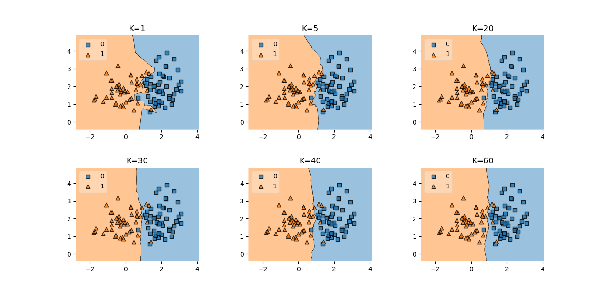
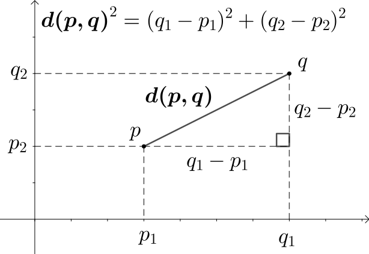

# K Nearest Neighbors

K Nearest Neighbors (KNN) is one of the simplest algorithms to understand and implement but despite its simplicity, it's still one of the best starting models for both regression and classification.

Unlike most other models for classification and regression, KNN falls under the category of [**lazy learning algorithms**](https://en.wikipedia.org/wiki/Lazy_learning), which means that there is **no explicit training phase before inference**. Instead, the generalization to the training data is delayed until a prediction is made.

Whilst this means that once you have your data the algorithm can immediately be used for inference, there is an inherent problem with this type of algorithm. In order for the algorithm to work we need to store the whole training set in memory. For this reason, KNN is mostly applied on small datasets.

## KNN Theory

To run KNN the following steps are needed:
1. Compute the distance between the item of interest and every item in the training-set.
2. Pick the k closest data points
3. Use the k closest points to make a prediction. For classification, a majority vote is used, which means that the class that occurs most often is used as the prediction. For regression, the average of the y values of the k points is used as the prediction

## Choosing the right value for K

When working with KNN there are two important hyperparameters – The **k-value** and the **distance metric**.

The optimal K-value will vary depending on your data-set. It should be big enough that noise won't affect the prediction but it should also be low enough that one class won't dominate another only because it's sheer amount of data-points.

There are many different ways the k-value can be determined. 

1. An arbitrary value can be chosen (not perfect but often good enough). The square root of n is a popular pick (n...Number of data-points in the training-set).
2. The best value can also be estimated by running the model with lots of different K values and choosing the best one.

## Distance Metrics

There are many different ways to compute the distance between two points, and the proper metric to use will be different depending on the data-set. Nonetheless, there are a few metrics that can be used for most data-sets.

### Euclidean Distance

Euclidean Distance is probably the one you're most familiar with. It describes what most of us think of when thinking about the distance between two points. It essentially is the straight-line distance between two points.

Above you can see the formula for two points in two dimensional space. Generally, the mathematical formula looks as follows:

$$d\left(p, q\right)=d\left(q, p\right)=\sqrt{(q_1-p_1)^2+(q_2-p_2)^2+...+(q_n-p_n)^2}=\sqrt{\sum_{i=1}^n\left(q_i-p_i\right)^2}$$

### Cosine Similarity

Another common metric is Cosine similarity. Rather than calculating a magnitude, Cosine similiarity calculates the cosine of the angle between the two featurevectors. If two vectors have a small angle between them the output will be close to 1 (very similar). On the other hand if the angles are far apart (near 180°) the similarity score will approach 0.

$$similarity=cos\left(\theta\right)=\frac{A*B}{\left|\left|A\right|\right| \left|\left|B\right|\right|}=\frac{\sum\limits_{i=1}^n A_iB_i}{\sqrt{\sum\limits_{i=1}^nA_i^2}\sqrt{\sum\limits_{i=1}^nB_i^2}}$$

This metric is often used for data-sets where the similarity between the directions of two data-points is more important than the magnitude.

In general, choosing a distance/similarity metric is often tricky, and therefore it might be best to just try multiple and see which one works best for a specific problem.

## Code

* [K Nearest Neighbors](code/k_nearest_neighbors.py)
* [K Nearest Neighbors Regression](code/k_nearest_neighbors_regression.py)

## Credit / Other resources

* https://en.wikipedia.org/wiki/K-nearest_neighbors_algorithm
* https://towardsdatascience.com/machine-learning-basics-with-the-k-nearest-neighbors-algorithm-6a6e71d01761
* https://scikit-learn.org/stable/modules/neighbors.html