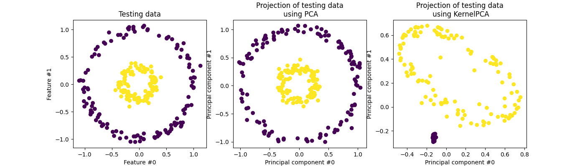

# Kernel PCA

Kernel PCA is an extension of [PCA](https://ml-explained.com/blog/principal-component-analysis-explained) that allows for the separability of nonlinear data by making use of kernels. The basic idea behind it is to project the linearly inseparable data onto a higher dimensional space where it becomes linearly separable. 

Kernel PCA can be summarized as a 4 step process [<a href="#citation1">1</a>]:

1. Construct the kernel matrix  from the training dataset

2. If the projected dataset  doesn’t have zero mean use the Gram matrix  to substitute the kernel matrix .

3. Use  to solve for the vector .

4. Compute the kernel principal components 

[1] <a href="https://arxiv.org/pdf/1207.3538.pdf">Kernel Principal Component Analysis and its Applications in Face Recognition and Active Shape Models</a>

## Resources

- [Kernel Principal Component Analysis and its Applications in Face Recognition and Active Shape Models](https://arxiv.org/pdf/1207.3538.pdf)
- [Kernel tricks and nonlinear dimensionality reduction via RBF kernel PCA](https://sebastianraschka.com/Articles/2014_kernel_pca.html)
- [PCA and kernel PCA explained](https://nirpyresearch.com/pca-kernel-pca-explained/)
- [What are the advantages of kernel PCA over standard PCA?](https://stats.stackexchange.com/questions/94463/what-are-the-advantages-of-kernel-pca-over-standard-pca)