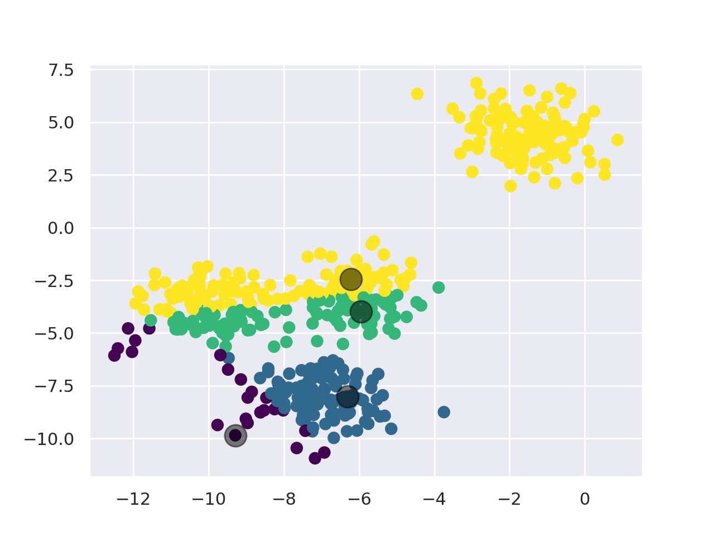
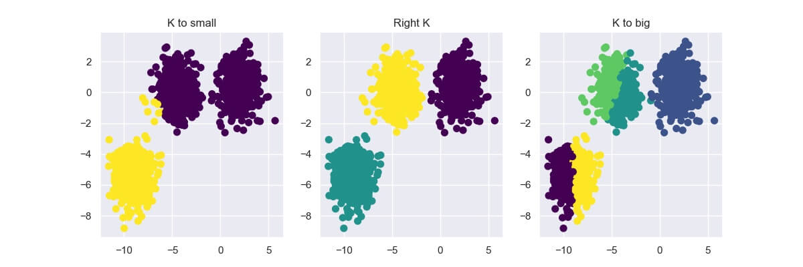
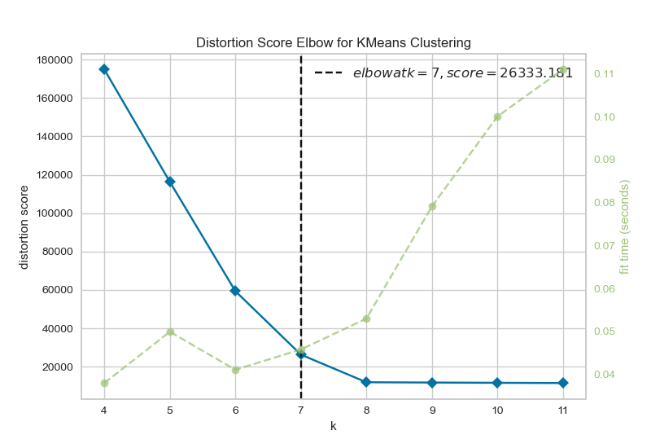
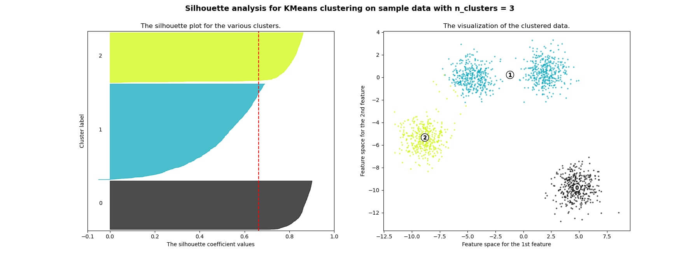
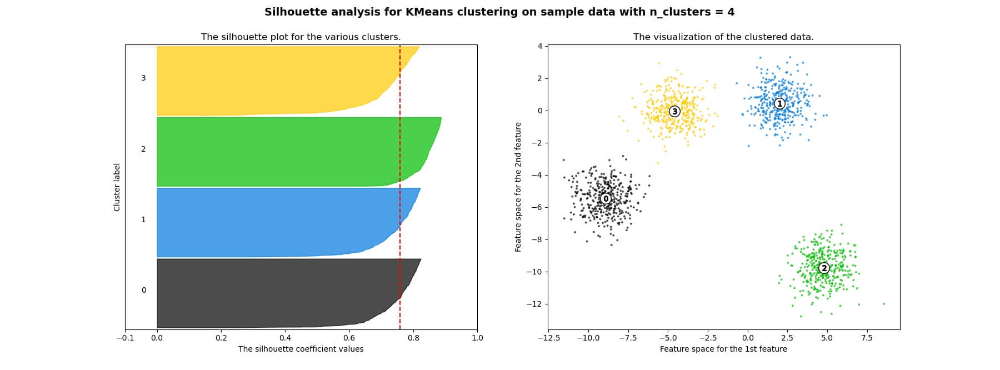
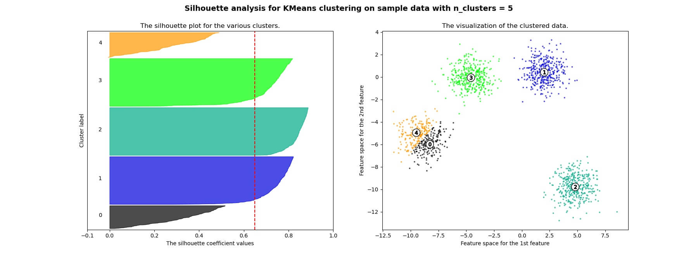
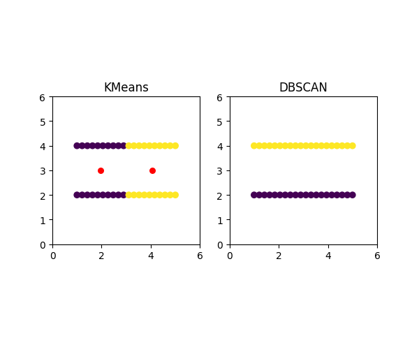
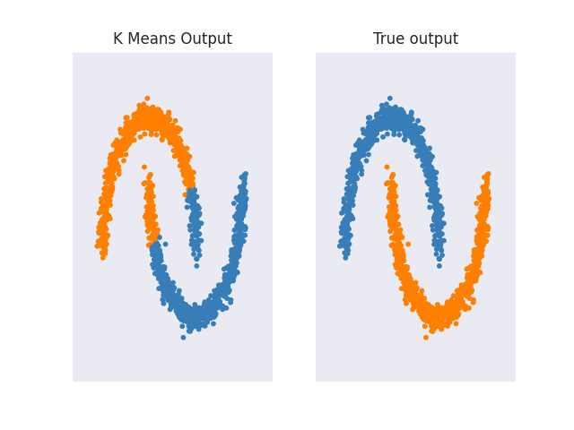
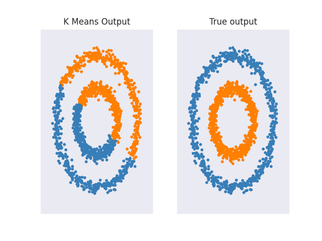

# KMeans Explained

Clustering is a machine learning technique that involves grouping similar data points together into so called clusters. Clustering is an unsupervised learning method commonly used in data science and other fields.

KMeans is probably the most well-known of all the clustering algorithm. Its goal is to separate the data into K distinct non-overlapping subgroups (clusters) of equal variance, minimizing a criterion known as the inertia or within-cluster sum-of-squares.

$$\sum_{i=0}^{n}\min\limits_{\mu_j \in C}\left(||x_i - \mu_j||^2\right)$$

## KMeans theory

KMeans works as follows:
1. First, pick the number of clusters (For more info, check the ["Choosing K" section](#choosing-k)).
2. Initialize the center points of the cluster (centroids) by shuffling the dataset and then selecting K data points for the centroids.
3. Assign data points to the cluster with the nearest centroid.
4. Recompute centroid position by taking the mean of all data points assigned to the cluster. 
5. Repeat steps 3 and 4 for a set number of iterations or until the centroids aren't moving much between iterations anymore.

## Choosing K

Choosing the right K value by hand can get quite tricky, especially if you're working with 3+ dimensional data. If you select a too small or big number for K, the result can be quite underwhelming.

In this section, I'll show you two methods commonly used to choose the right K value:
* The Elbow Method
* Silhouette Analysis

### Elbow Method

The Elbow Method shows us what a good number for K is based on the sum of squared distances (SSE) between data points and their assigned clusters' centroid. We pick k at the spot where the SSE starts to flatten out, which looks like an elbow. Below you can see an example created using [Yellowbrick](https://www.scikit-yb.org/en/latest/api/cluster/elbow.html).

### Silhouette Analysis

The Silhouette Analysis can be used to study the separation distance between the resulting clusters. It displays a measure of how similar an object is to its own cluster (cohesion) compared to other clusters (separation) and can thus be used to assess the number of clusters k. 

The Silhouette Analysis is computed as follows:
* Compute the average distance between all data points in one cluster $C_i$
$$a\left(i\right)=\frac{1}{|C_i|-1}\sum_{j\in C_i,i\neq j}d\left(i,j\right)$$
* For all data points $i$ in cluster $C_i$ compute the average distance to all points in another cluster $C_k$ (where $C_k\neq C_i$) 
$$b\left(i\right)=\min\limits_{k\neq i}\frac{1}{|C_k|}\sum_{j\in C_k}d\left(i,j\right)$$

>The $min$ is used, because we want to know the average distance to the closed cluster $i$ is not a member of.

With $a$ and $b$ we can now calculate the silhouette coefficient:

$$s\left(i\right)=\frac{b\left(i\right)-a\left(i\right)}{max\{a\left(i\right),b\left(i\right)\}}, if |C_i|>1$$

The coefficient can take values in the interval $[-1, 1]$. Zero means the sample is very close to the neighboring clusters. One means the sample is far away from the neighboring cluster, and negative one means the sample is probably assigned to the wrong cluster.

Below you can see an [example of silhouette analysis](https://scikit-learn.org/stable/auto_examples/cluster/plot_kmeans_silhouette_analysis.html) using [Scikit Learn](https://scikit-learn.org/stable/index.html):

## Advantages

KMeans is an easy-to-implement algorithm that is also quite fast with an average complexity of $O(k*n*T)$, where n is the number of samples, and T is the number of iteration.

## Drawbacks

As mentioned above, KMeans makes use of the **sum-of-squares criterion**, which works well if the clusters have a spherical-like shape. It doesn't work well on many other types of data like complicated shapes, though. In this section, we'll go over a few cases where KMeans performs poorly.

First, KMeans doesn't put data points that are far away from each other into the same cluster, even when they obviously should be because they underly some obvious structure like points on a line, for example.

In the image above, you can see that KMeans creates the clusters in between the two lines and therefore splits each line into one of two clusters rather than classifying each line as a cluster. On the right side, you can see the DBSCAN (Density-based spatial clustering of applications with noise) algorithm, which is able to separate the two lines without any issues.

Also, as mentioned at the start of the section KMeans performs poorly for complicated geometric shapes such as the moons and circles shown below.

Other clustering algorithms like Spectral Clustering, Agglomerative Clustering, or DBSCAN don't have any problems with such data. For a more in-depth analysis of how different clustering algorithms perform on different interesting 2d datasets, I recommend checking out ['Comparing different clustering algorithms on toy datasets'](https://scikit-learn.org/stable/auto_examples/cluster/plot_cluster_comparison.html) from Scikit-Learn.  

## Code
* [KMeans from Scratch in Python](code/kmeans.py)

## Credit / Other resources
* https://scikit-learn.org/stable/modules/clustering.html#k-means
* https://towardsdatascience.com/k-means-clustering-algorithm-applications-evaluation-methods-and-drawbacks-aa03e644b48a
* https://www.youtube.com/watch?v=4b5d3muPQmA