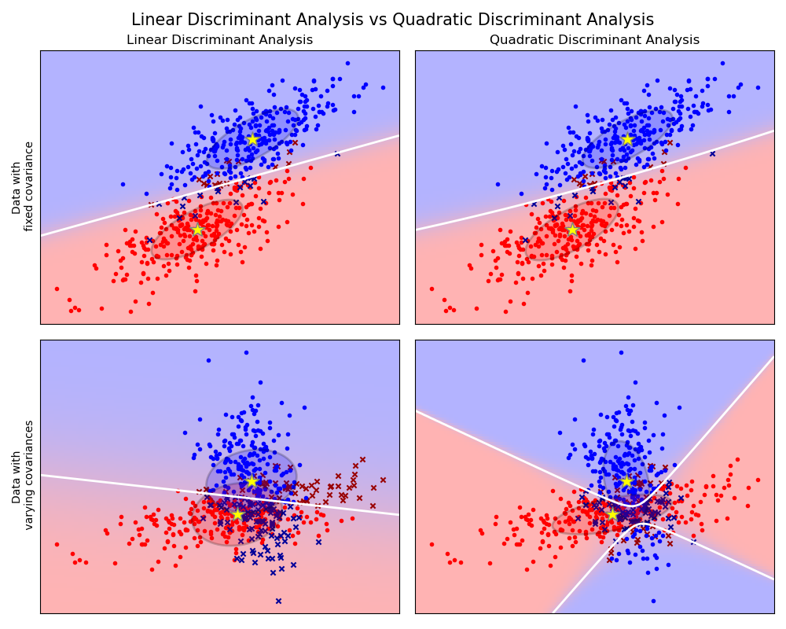

# Linear Discriminant Analysis (LDA)

Linear Discriminant Analysis (LDA) is a dimensionality reduction technique commonly used for supervised classification problems. The goal of LDA is to project the dataset onto a lower-dimensional space while maximizing the class separability.

LDA is very similar to Principal Component Analysis (PCA), but there are some important differences. PCA is an unsupervised algorithm, meaning it doesn't need class labels . PCA's goal is to find the principal components that maximize the variance in a dataset. LDA, on the other hand, is a supervised algorithm, which uses both the input data  and the class labels  to find linear discriminants that maximize the separation between multiple classes.

LDA can be performed in 5 steps:
1. Compute the mean vectors for the different classes from the dataset.
2. Compute the scatter matrices (in-between-class and within-class scatter matrices).
3. Compute the eigenvectors and corresponding eigenvalues for the scatter matrices.
4. Sort the eigenvectors by decreasing eigenvalues and choose k eigenvectors with the largest eigenvalues.
5. Use this eigenvector matrix to transform the samples onto the new subspace.

## Computing the mean vectors

First, calculate the mean vectors for all classes inside the dataset.

## Computing the scatter matrices

After calculating the mean vectors, the within-class and between-class scatter matrices can be calculated.

### Within-class scatter matrix 

where  is the scatter matrix for a specific class

and  is the mean vector for that class

Alternativeley the class-covariance matrices can be used by adding the scaling factor  to the within-class scatter matrix.

### Between-class scatter matrix 

where  is the overall mean,  is the mean of the respective class, and  is the sample size of that class.

## Calculate linear discriminants

Next, LDA solves the [generalized eigenvalue problem](https://arxiv.org/pdf/1903.11240.pdf) for the matrix  to obtain the linear discriminants.

## Select linear discriminants for the new feature subspace

After calculating the eigenvectors and eigenvalues, we sort the eigenvectors from highest to lowest depending on their corresponding eigenvalue and then choose the top  eigenvectors, where  is the number of dimensions we want to keep. 

## Transform data onto the new subspace

After selecting the  eigenvectors, we can use the resulting -dimensional eigenvector matrix  to transform data onto the new subspace via the following equation:

## Code

- [LDA Numpy Implementation](code/linear_discriminant_analysis.py)

## Credit / Resources

- [Linear Discriminant Analysis Bit by Bit](https://sebastianraschka.com/Articles/2014_python_lda.html)
- [StatQuest: Linear Discriminant Analysis (LDA) clearly explained.](https://www.youtube.com/watch?v=azXCzI57Yfc)
- [1.2. Linear and Quadratic Discriminant Analysis](https://scikit-learn.org/stable/modules/lda_qda.html)
- [ML-From-Scratch MultiClassLDA](https://github.com/eriklindernoren/ML-From-Scratch/blob/master/mlfromscratch/supervised_learning/multi_class_lda.py)
- [mlxtend LDA](https://github.com/rasbt/mlxtend/blob/master/mlxtend/feature_extraction/linear_discriminant_analysis.py)