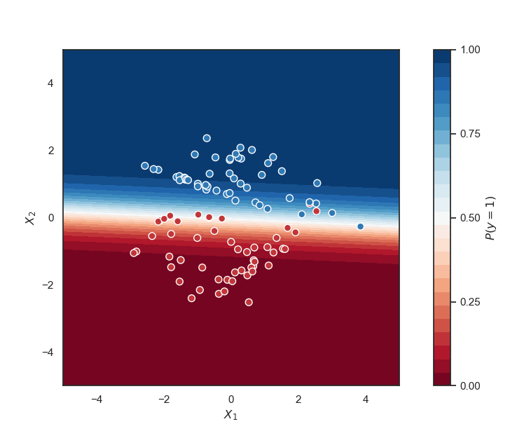
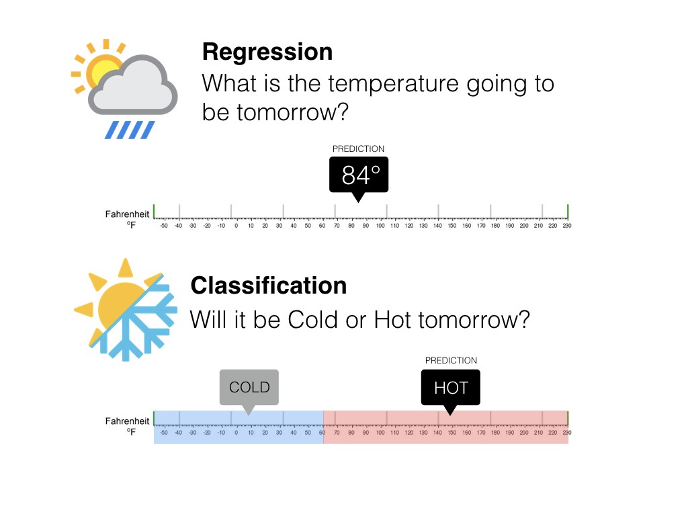
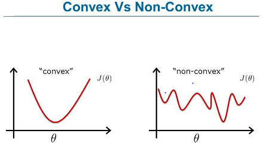
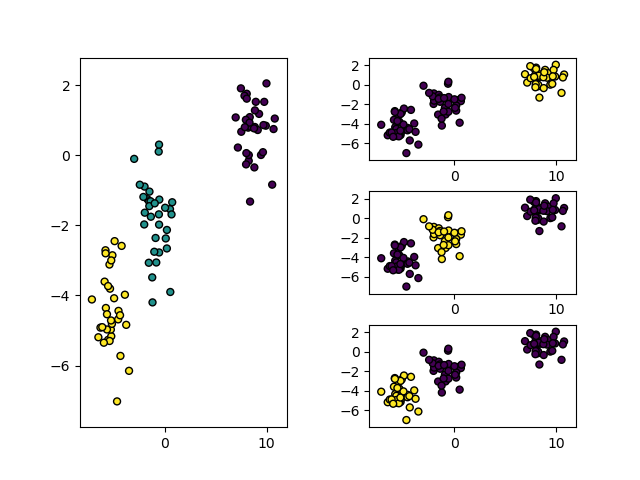
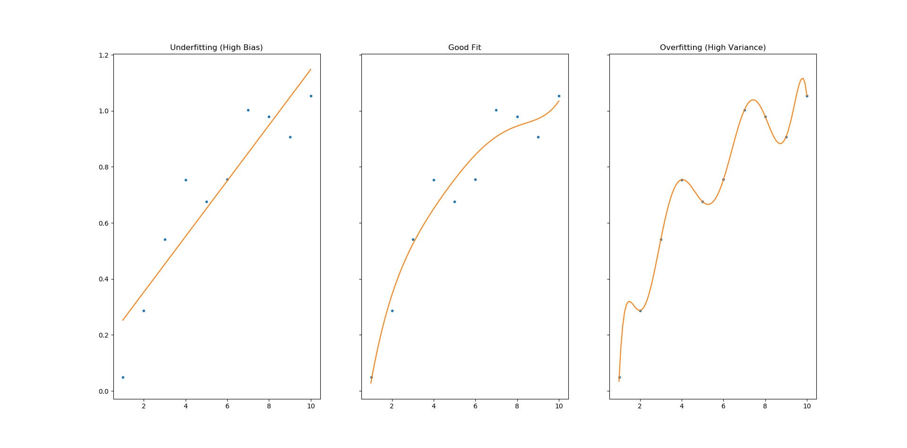

# Logistic Regression

Logistic Regression is a classical statistical model, which has been widely used in academia and industry to solve binary classification problems. 

## Difference between Regression and Classification

Supervised Machine Learning can be split into two subcategories – Regression and Classification. 

The difference between the two is that in Regression we are predicting a continuous number like the price of a house or the temperature for the next day whilst in Classification, we are predicting discrete values like if a patient has or doesn't have a heart disease.

## Logistic Regression Theory

Logistic Regression is a statistical method that was designed to solve binary classification problems. It achieves this by passing the input through a linear function and then transforming the output to a probability value with the help of a [sigmoid function](https://en.wikipedia.org/wiki/Sigmoid_function).

Mathematically this looks like:

### Sigmoid Function

Without the Sigmoid function, Logistic Regression would just be Linear Regression. That means that the output of the model could range from -∞ to ∞.

That's fine when working on a regression task but for binary classification, the output needs to be a probability value. This is where the sigmoid function comes in. It squeezes the output of the linear function Z between 0 and 1. All input values greater than 0 produce an output greater than 0.5. All inputs less than 0 produce an output between less than 0.5.

Mathematically the sigmoid function looks like:

### Decision Boundary

To get a discrete class value (either 0 or 1) a decision boundary must be chosen. The decision boundary specifies how high the probability must be so that we have an output of 1.

Generally, the decision boundary is 0.5 so that if the output is >=0.5 we get class 1, else class 0.

### Loss Function

For Logistic Regression we can't use the same loss function as for Linear Regression because the Logistic Function (Sigmoid Function) will cause the output to be non-convex, which will cause many local optima.

Instead, we will use the following loss function for logistic regression:

At first glance, the functions look complex but when visualized they are quite easy to grasp.

The above graph shows that the further away the prediction is from the actual y value the bigger the loss gets.

That means that if the correct answer is 0, then the cost function will be 0 if the prediction is also 0. If the prediction approaches 1, then the cost function will approach infinity.

If the correct answer is 1, then the cost function will be 0 if the prediction is 1. If the prediction approaches  0, then the cost function will approach infinity.

### Simplifying the Loss Function

To make it easier to work with the loss function we can compress the two conditional cases into one equation:

Notice that when y is equal to 1 the second term will be zero and therefore will not affect the loss. 

One the other hand if y is equal to 0 the first term will be zero and therefore will not affect the loss.

Vectorized this looks like:

### Gradient Descent

To find the coefficients (weights) that minimize the loss function we will use Gradient Descent. There are more sophisticated optimization algorithms out there such as [Adam](https://arxiv.org/abs/1412.6980) but we won't worry about those in this article.

Remember the general form of gradient descent looks like:

We can get the gradient descent formula for Logistic Regression by taking the derivative of the loss function. This is quite involved therefore I will show you the result first and you can skip the process of getting to the result if you like.

Result:

Notice that the result is identical to the one of Linear Regression.

## Deriving the Gradient Descent formula for Logistic Regression (Optional)

First we need to calculate the derivative of the sigmoid function. The derivative of the sigmoid function is quite easy to calulcate using [the quotient rule](https://www.khanacademy.org/math/ap-calculus-ab/ab-differentiation-1-new/ab-2-9/a/quotient-rule-review).

Now we are ready to find out the partial derivative:

## Multiclass Classification: One-vs-all

Eventhough Logistic Regression was created to solve binary classification problems it can also be used for more than two classes.

In this case, the problem is divided into n+1 subproblems (n+1=number of highest class +1).

In each subproblem we predict the probability that y is a member of one of our classes.

We are basically choosing one class and putting all the others into a single class. We do this repeatedly until we went through each classes. Then we will find the result with the highest value and use this class as our prediction.

## Regularized Logistic Regression

As you might know, regularization is a set of techniques designed to combat overfitting. Overfitting or also called high variance is the state when the model fits the available data but doesn't generalize well to unseen data. It is usually caused by an overcomplicated prediction function that creates lots of unnecessary curves and angles unrelated to the data.

There are two main options to address overfitting:
* Reducing the number of features
* Regularization

Manually reducing the number of features can be a tedious task because it often includes a lot of trial and error. Regularization, on the other hand, can happen automatically and has proven to be very reliable for lots of models over the years.

Logistic Regression can be regularized with the same techniques I explained when taking a look at [Linear Regression](https://gilberttanner.com/blog/linear-regression-explained#regularization) – L1 and L2 Regularization.

Both techniques work by reducing the weights of the model by increasing their cost/loss. L1 Regularization takes the absolute values of all the weights and adds their sum to the loss. L2 Regularization sums up the squares instead of the absolute values.

For more information on the difference between L1 and L2 Regularization check out the following article:
* http://www.chioka.in/differences-between-l1-and-l2-as-loss-function-and-regularization/

L1 Regularization for Logistic Regression:

L2 Regularization for Logistic Regression:

As you can see above you not only can change from L1 to L2 Regularization but you can also increase or decrease the effect of regularization using .

## Code

* [Logistic Regression](code/logistic_regression.py)
* [One vs. All Logistic Regression](code/one_vs_all_logistic_regression.py)
* [Custom Implementation vs. Scikit Learn](code/custom_implementation_vs_sklearn.ipynb)

## Credit / Other resources

* https://www.coursera.org/learn/machine-learning/resources/Zi29t
* https://towardsdatascience.com/logistic-regression-detailed-overview-46c4da4303bc
* https://christophm.github.io/interpretable-ml-book/logistic.html