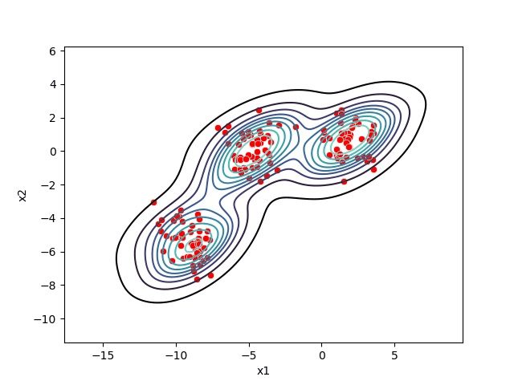
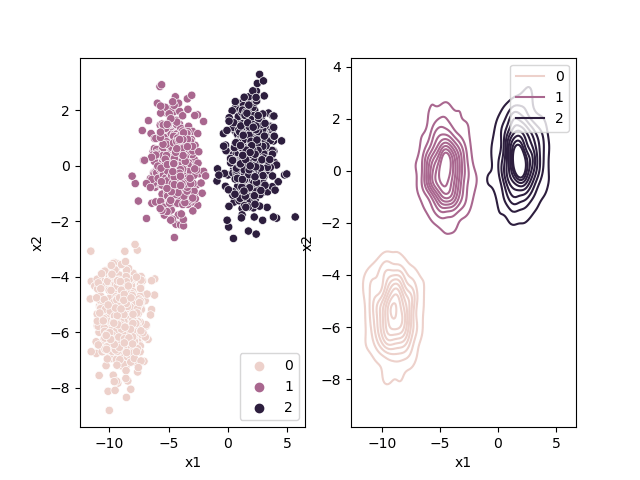
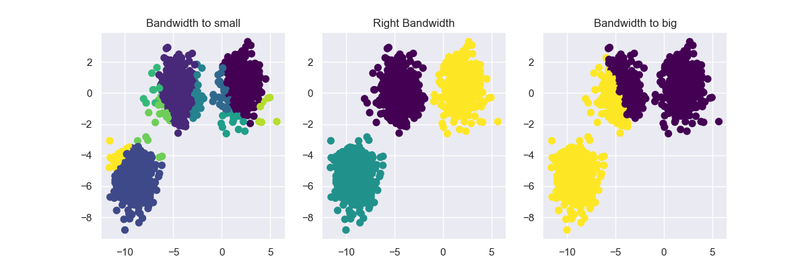

# Mean Shift

Mean Shift is an unsupervised clustering algorithm that aims to discover blobs in a smooth density of samples. It is a centroid-based algorithm that works by updating candidates for centroids to be the mean of the points within a given region (also called bandwidth). These candidates are then filtered in a post-processing stage to eliminate near-duplicates to form the final set of centroids. Therefore contrary to [KMeans](https://ml-explained.com/blog/kmeans-explained), we don't need to choose the number of clusters ourselves.

## Mean Shift Steps

On a high level, Mean Shift works as follows:

1. Create a sliding window/cluster for each data-point
2. Each of the sliding windows is shifted towards higher density regions by shifting their centroid (center of the sliding window) to the data-points' mean within the sliding window. This step will be repeated until no shift yields a higher density (number of points in the sliding window)
3. Selection of sliding windows by deleting overlapping windows. When multiple sliding windows overlap, the window containing the most points is preserved, and the others are deleted.
4. Assigning the data points to the sliding window in which they reside.

## Kernel Density Estimation

What Mean Shift is doing is shifting the windows to a higher density region by shifting their centroid (center of the sliding window) to the mean of the data-points inside the sliding window. We can also look at this by thinking of our data points as a probability density function.

Higher density regions correspond to regions with more data-points, and lower density regions correspond to regions with fewer points. Mean Shift tries to find the high-density regions by continually shifting the sliding window closer to the peak of the region. This is also known as [hill climbing](https://en.wikipedia.org/wiki/Hill_climbing).

## Choosing the right bandwidth / radius

Depending on the bandwidth, the resulting clusters can look quite different. As an extreme case, imagine that we choose an extremely small bandwidth. This will result in each point having its own cluster. On the other hand, if we use a huge bandwidth, there will only be one cluster containing all the data-points.

Below you can see an image of different bandwidth values (not as extreme cases then mentioned above):

Choosing the correct bandwidth by hand might work for small two-dimensional data-sets but will be pretty hard as the data-set gets bigger and bigger. Therefore instead of selecting the bandwidth by hand, you can estimate it using your data. For more information, check out:

- [Scikit-Learn estimate_bandwidth](https://scikit-learn.org/stable/modules/generated/sklearn.cluster.estimate_bandwidth.html)
- [Mean Shift Dynamic Bandwidth - Practical Machine Learning Tutorial with Python p.42](https://www.youtube.com/watch?v=k1alPDpSGBE)

## Advantages

Mean Shift is a simple cluster method that works very well on spherical-shaped data. Furthermore, it automatically selects the number of clusters contrary to other clustering algorithms like [KMeans](https://ml-explained.com/blog/kmeans-explained). Also, the output of Mean Shift is not dependent on the initialization since, at the start, each point is a cluster.

## Drawbacks

The algorithm is not highly scalable, as it requires multiple nearest neighbor searches during its execution. It has a complexity of O(n^2). Furthermore, manually choosing the bandwidth can be non-trivial, and selecting a wrong value can lead to bad results.

It also fails to find the correct clusters for some data-sets, as shown on the ['Comparing different clustering algorithms on toy datasets' page](https://scikit-learn.org/stable/auto_examples/cluster/plot_cluster_comparison.html) from Scikit-Learn.

## Code

- [Mean Shift from Scratch in Python](code/mean_shift.py)

## Credit / Other resources

- https://scikit-learn.org/stable/modules/clustering.html#mean-shift
- https://www.youtube.com/watch?v=3ERPpzrDkVg
- https://iq.opengenus.org/mean-shift-clustering-algorithm/
- https://spin.atomicobject.com/2015/05/26/mean-shift-clustering/
- https://en.wikipedia.org/wiki/Mean_shift
