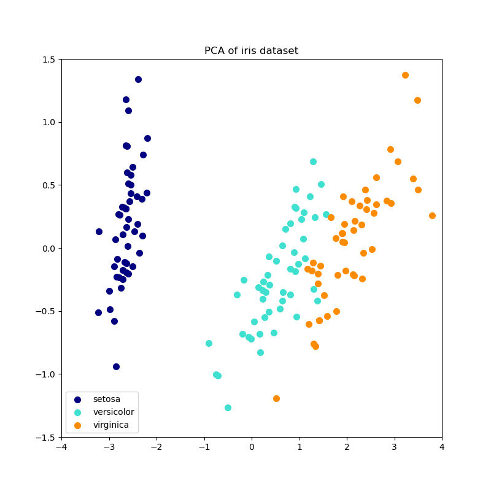

# Principal Component Analysis (PCA)

Principal Component Analysis (PCA) is an unsupervised dimensionality reduction technique. The goal of PCA is to project the dataset onto a lower-dimensional space while preserving as much of the variance of the dataset as possible.

PCA can be performed in 6 steps:

1. Subtract the mean of each variable
2. Calculate the Covariance Matrix
3. Compute the Eigenvalues and Eigenvectors
4. Sort Eigenvectors by corresponding Eigenvalues in descending order and select a subset from the rearranged Eigenvalue matrix
5. Recast data along the principal components

## 1. Subtract the mean of each variable

First, subtract the mean of each variable from the dataset so that the dataset is centered around the origin. By default, most implementations of PCA, including Scikit-Learn, only center the data but don't scale it to be between 0-1.

## 2. Calculate the Covariance Matrix

After centering the dataset, the [covariance matrix](https://en.wikipedia.org/wiki/Covariance_matrix) is calculated. The covariance matrix is a symmetric square matrix giving the covariance between each pair of elements. Since the covariance of a variable with itself is its variance, the main diagonal (top left to bottom right) contains the variances of each initial variable.

The [covariance](https://en.wikipedia.org/wiki/Covariance) tells us about the correlations between the variables. If the sign of the covariance is positive, then the two variables increase and decrease together. If, on the other hand, the sign of the covariance is negative, then one variable increases as the other decreases.

## 3. Compute the Eigenvalues and Eigenvectors

Next, compute the [Eigenvalues and eigenvectors](https://en.wikipedia.org/wiki/Eigenvalues_and_eigenvectors). The eigenvectors of the covariance matrix are the directions of the axes where there is the most variance (most information). Eigenvalues are simply the coefficients attached to eigenvectors, which give the amount of variance carried in each Eigenvector / Principal Component.

## 4. Sort Eigenvectors by corresponding Eigenvalues in descending order and select a subset from the rearranged Eigenvalue matrix

By ranking the eigenvectors in order of their eigenvalues, highest to lowest, you get the principal components in order of significance and then choose the top $k$ eigenvectors, where $k$ is the number of dimensions we want to keep.

## 5. Recast data along the principal components

After selecting the $k$ eigenvectors, we can use the resulting $d \times k$-dimensional eigenvector matrix $W$ to transform data onto the new subspace via the following equation:

$$Y = X \times W$$

## Resources

- [Principal component analysis: a review and recent developments](https://royalsocietypublishing.org/doi/10.1098/rsta.2015.0202)
- [2.5. Decomposing signals in components (matrix factorization problems)](https://scikit-learn.org/stable/modules/decomposition.html)
- [StatQuest: Principal Component Analysis (PCA), Step-by-Step](https://www.youtube.com/watch?v=FgakZw6K1QQ)
- [Principal Component Analysis from Scratch in Python](https://www.askpython.com/python/examples/principal-component-analysis)
- [ML From Scratch, Part 6: Principal Component Analysis](http://www.oranlooney.com/post/ml-from-scratch-part-6-pca/)
- [A Step-by-Step Explanation of Principal Component Analysis (PCA)](https://builtin.com/data-science/step-step-explanation-principal-component-analysis)