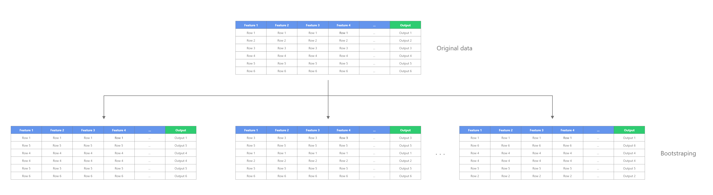
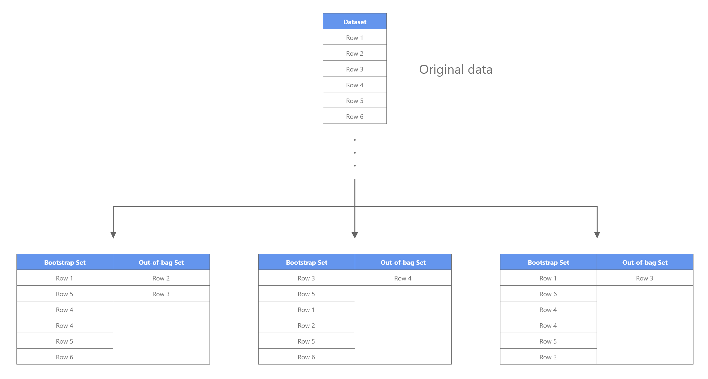

# Random Forest

Random forests are an ensemble learning method for classification and regression that use Decision trees as base models. <a href="#reference1">[1]</a>

Ensemble learning methods combine multiple base models to get a more accurate one. There are many ways models can be combined, ranging from simple methods like averaging or max voting to more complex ones like boosting or stacking.

## Bootstrap aggregating

The Random Forest algorithm uses Bootstrap aggregating, also called **[bagging](https://en.wikipedia.org/wiki/Bootstrap_aggregating),** as its ensembling method. It gains accuracy and combats overfitting by not only averaging the models but also trying to create models that are as uncorrelated as possible by giving them different training data-sets. Although it's usually applied to decision tree methods, it can also be used with other models.

It creates the data-sets using [sampling with replacement](https://www.quora.com/Why-does-random-forest-use-sampling-with-replacement-instead-of-without-replacement) a straightforward but sufficient data sampling technique. Sampling with replacement means that some data-points can be picked multiple times. For more information, check out ["Sampling With Replacement / Sampling Without Replacement"](https://www.statisticshowto.com/sampling-with-replacement-without/).

## Select a random subset of variables

To further decrease the correlation between individual trees, each decision tree is trained on different randomly selected features. The number of features used for each individual tree is a hyperparameter, often called max_features or n_features.

So each decision tree in a random forest is not only trained on a different data-set (thanks to bagging) but also on different features/columns. After the individual decision trees are trained, they are combined together. For classification, max voting is used. That means the class, which most trees have as the output, will be the Random Forest's output. For regression, the outputs of the Decision Trees are averaged.

## Out-Of-Bag Error

Out-of-bag (OOB) error, also sometimes called out-of-bag estimation, is a method of measuring the prediction error of algorithms that are using bootstrap aggregation (bagging), such as random forests. The out-of-bag error is the average error on each training sample , calculated using predictions from the trees that do not contain  in their respective bootstrap samples.

Out-of-Bag error is handy because, contrary to a validation set, no data must be set aside. Below you can see an example of how the bootstrap sets and out-of-bag sets are created.

## Important Hyperparameters

Random Forest has lots of hyperparameters that can be tuned to either increase the predictive power or to make the model smaller and faster.

- **Number of Estimators:** The number of trees in the forest.
- **Split criteria:** The function to measure the quality of a split (Gini impurity or Entropy for classification and Mean-Squared-Error (MSE) or Mean-Absolute-Error (MAE) for regression)
- **Maximum depth:** The maximum depth of a tree
- **Minimum samples per split:** The minimum number of samples required to split an internal node
- **Minimum samples per leaf:** The minimum number of samples required to be at a leaf node.
- **Maximum number of features:** The number of features to consider when looking for the best split.

For more information about the available hyperparameters and how to correctly tune them for your application, take a look at the below resources.

Resources:

- [Scikit-Learn documentation](https://scikit-learn.org/stable/modules/generated/sklearn.ensemble.RandomForestClassifier.html)
- [A COMPLETE GUIDE TO THE RANDOM FOREST ALGORITHM](https://builtin.com/data-science/random-forest-algorithm#hyperparameters)
- [Hyperparameter Tuning the Random Forest in Python](https://towardsdatascience.com/hyperparameter-tuning-the-random-forest-in-python-using-scikit-learn-28d2aa77dd74)
- [Random Forest: Hyperparameters and how to fine-tune them](https://towardsdatascience.com/random-forest-hyperparameters-and-how-to-fine-tune-them-17aee785ee0d)

## Feature importance

Feature importance refers to techniques that assign an importance score to all the features based on how useful they are to predict the correct label. There are many ways feature importance can be calculated, including [permutation feature importance](https://christophm.github.io/interpretable-ml-book/feature-importance.html) or a game-theoretic approach like [shap](https://github.com/slundberg/shap). But feature importance can also be calculated directly from the Random Forest model by looking at each decision tree's split points. For each feature, we can collect the average decrease in loss. The average over all trees in the forest is the measure of the feature importance.

Resources:
- [Permutation Feature Importance](https://christophm.github.io/interpretable-ml-book/feature-importance.html)
- [Random Forest Feature Importance Computed in 3 Ways with Python](https://mljar.com/blog/feature-importance-in-random-forest/)
- [Feature importances with forests of trees](https://scikit-learn.org/stable/auto_examples/ensemble/plot_forest_importances.html)

## Code

- [Random Forest Classifier](code/random_forest_classifier.py)
- [Random Forest Regressor](code/random_forest_regressor.py)
- [Scikit-Learn Out-of-bag Error example](code/scikit-learn/out_of_bag_error_example.py)
- [Scikit-Learn Feature importance example](code/scikit-learn/feature_importance_example.py)
- [Shap Feature importance example](code/shap_feature_importance_example.py)
- [eli5 Feature importance example](code/eli5_feature_importance_example.py)

## Credit / Other resources

- [https://scikit-learn.org/stable/modules/ensemble.html#forest](https://scikit-learn.org/stable/modules/ensemble.html#forest)
- [https://www.youtube.com/watch?v=J4Wdy0Wc_xQ](https://www.youtube.com/watch?v=J4Wdy0Wc_xQ)
- [https://towardsdatascience.com/understanding-random-forest-58381e0602d2](https://towardsdatascience.com/understanding-random-forest-58381e0602d2)
- [https://builtin.com/data-science/random-forest-algorithm](https://builtin.com/data-science/random-forest-algorithm)
- [https://en.wikipedia.org/wiki/Random_forest](https://en.wikipedia.org/wiki/Random_forest#:~:text=Random%20forests%20or%20random%20decision,prediction%20(regression)%20of%20the%20individual)
- [https://williamkoehrsen.medium.com/random-forest-simple-explanation-377895a60d2d](https://williamkoehrsen.medium.com/random-forest-simple-explanation-377895a60d2d)
- [https://towardsdatascience.com/random-forests-and-decision-trees-from-scratch-in-python-3e4fa5ae4249](https://towardsdatascience.com/random-forests-and-decision-trees-from-scratch-in-python-3e4fa5ae4249)

[1] Random forest. (2021, March 14). In Wikipedia. https://en.wikipedia.org/wiki/Random_forest

