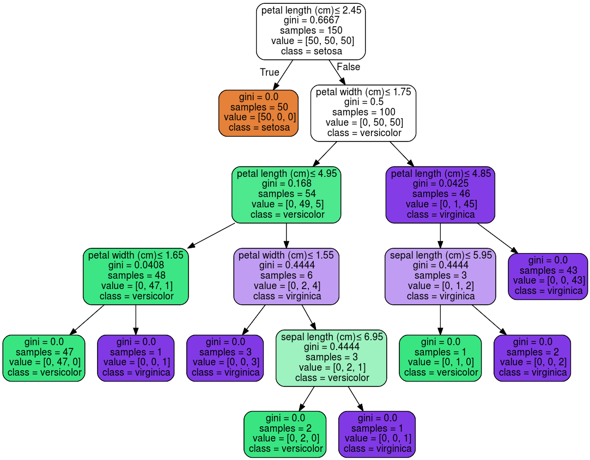

# Decision Trees

## Introduction

Decision Trees (DTs) are a non-parametric supervised learning method used for classification and regression. The goal is to create a model that predicts the value of a target variable by learning simple decision rules inferred from the data. DTs are highly interpretable, capable of achieving high accuracy for many tasks, and they require little data preparation.

## More information

For more information about Decision Trees (DTs) be sure to check out my article ["Decision Trees Explained"](https://gilberttanner.com/blog/decision-trees-explained).