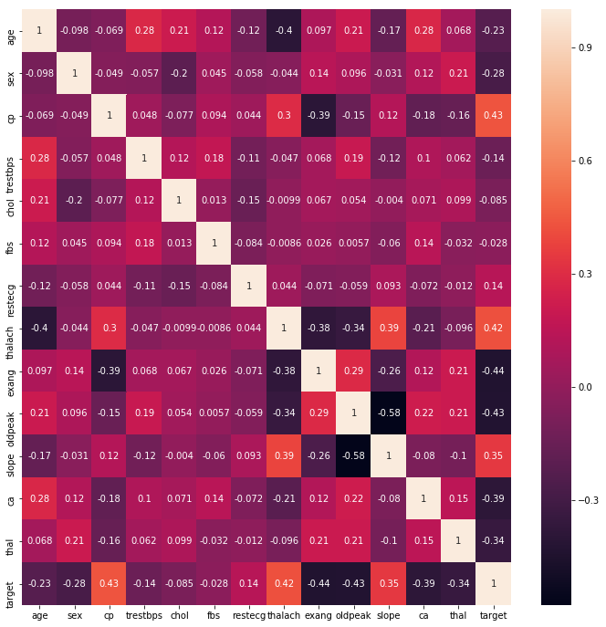

# Metrics

## Classification

### Binary cross entropy

Binary cross entropy is a loss function used for binary classification tasks (tasks with only two outcomes/classes). It works by calculating the following average:

The above equation can be split into two parts to make it easier to understand:

The above graph shows that the further away the prediction is from the actual y value the bigger the loss gets.

That means that if the correct answer is 0, then the cost function will be 0 if the prediction is also 0. If the prediction approaches 1, then the cost function will approach infinity.

If the correct answer is 1, then the cost function will be 0 if the prediction is 1. If the prediction approaches 0, then the cost function will approach infinity.

Resources:

- [Understanding Categorical Cross-Entropy Loss, Binary Cross-Entropy Loss, Softmax Loss, Logistic Loss, Focal Loss and all those confusing names](https://gombru.github.io/2018/05/23/cross_entropy_loss/#binary-cross-entropy-loss)
- [Cross entropy](https://en.wikipedia.org/wiki/Cross_entropy)
- [Understanding binary cross-entropy / log loss: a visual explanation](https://towardsdatascience.com/understanding-binary-cross-entropy-log-loss-a-visual-explanation-a3ac6025181a)

Code:

- [Binary Cross Entropy Numpy Implementation](code/binary_cross_entropy.py)

### Categorical Crossentropy

Categorical crossentropy is a loss function used for multi-class classification tasks. The outputed loss is the negative average of the sum of the true values  multiplied by the log of the predicted values .

Resources:

- [Understanding Categorical Cross-Entropy Loss, Binary Cross-Entropy Loss, Softmax Loss, Logistic Loss, Focal Loss and all those confusing names](https://gombru.github.io/2018/05/23/cross_entropy_loss/#losses)
- [Categorical crossentropy](https://peltarion.com/knowledge-center/documentation/modeling-view/build-an-ai-model/loss-functions/categorical-crossentropy)

Code:

- [Categorical Cross Entropy Numpy Implementation](code/categorical_cross_entropy.py)

### Accuracy Score

The fraction of predictions the model classified correctly.

or

For binary classification, accuracy can also be calculated in terms of positives and negatives as follows:

Where , , , and .

Resources:

- ['Classification: Accuracy' Google Machine Learning Crash Course](https://developers.google.com/machine-learning/crash-course/classification/accuracy)
- [Accuracy Score Scikit Learn](https://scikit-learn.org/stable/modules/model_evaluation.html#accuracy-score)
- [Precision and recall](https://en.wikipedia.org/wiki/Precision_and_recall)

Code:

- [Accuracy Score Numpy Implementation](code/accuracy_score.py)

### Confusion matrix

A confusion matrix is a table that summarises the predictions of a classifier or classification model. By definition, entry  in a confusion matrix is the number of observations actually in group , but predicted to be in group .

Resources:

- [Confusion matrix Scikit-Learn](https://scikit-learn.org/stable/modules/model_evaluation.html#confusion-matrix)
- [What is a Confusion Matrix in Machine Learning](https://machinelearningmastery.com/confusion-matrix-machine-learning/)
- [Simple guide to confusion matrix terminology](https://www.dataschool.io/simple-guide-to-confusion-matrix-terminology/)

### Hinge Loss

Hinge loss is a loss function usef for "maximum-margin" classification, most notably for Support Vector Machines (SVMs).

Resources:

- [Hinge Loss Scikit-Learn](https://scikit-learn.org/stable/modules/model_evaluation.html#hinge-loss)
- [Hinge loss Wikipedia](https://en.wikipedia.org/wiki/Hinge_loss)
- [What is the definition of the hinge loss function?](https://ai.stackexchange.com/a/26336)

Code:

- [Hinge Loss Numpy Implementation](code/hinge.py)

### KL Divergence

The **Kullback-Leibler divergence**, , often shortenend to just KL divergence, is a measure of how one probability distribution is different from a second, reference porbability distribution.

Resources:

- [Kullback–Leibler divergence Wikipedia](https://en.wikipedia.org/wiki/Kullback%E2%80%93Leibler_divergence)
- [Kullback-Leibler Divergence Explained](https://www.countbayesie.com/blog/2017/5/9/kullback-leibler-divergence-explained)

Code:

- [KL Divergence Numpy Implementation](code/kl_divergence.py)

## Regression

### Mean Squared Error

The **mean squared error (MSE)** or **mean squared deviation (MSD)** measure the average of the squares of the errors - that is, the average squared differences between the estimated and actual values.

Resources:

- [Mean squared error Wikipedia](https://en.wikipedia.org/wiki/Mean_squared_error)
- [Mean squared error Scikit-Learn](https://scikit-learn.org/stable/modules/model_evaluation.html#mean-squared-error)
- [Machine learning: an introduction to mean squared error and regression lines](https://www.freecodecamp.org/news/machine-learning-mean-squared-error-regression-line-c7dde9a26b93/)

Code:

- [Mean Squared Error Numpy Implementation](code/mean_squared_error.py)

### Mean Squared Logarithmic Error

**Mean Squared Logarithmic Error (MSLE)** is an extension of [**Mean Squared Error (MSE)**](#mean-squared-error) often used when the target  has an exponential growth.

> Note: This metrics penalizes under-predictions greater than over-predictions.

Code:

- [Mean Squared Logarithmic Error Numpy Implementation](code/mean_squared_log_error.py)

Resources:

- [Mean squared logarithmic error (MSLE)](<https://peltarion.com/knowledge-center/documentation/modeling-view/build-an-ai-model/loss-functions/mean-squared-logarithmic-error-(msle)>)
- [Mean squared logaritmic error Scikit-Learn](https://scikit-learn.org/stable/modules/model_evaluation.html#mean-squared-logarithmic-error)
- [Understanding the metric: RMSLE](https://www.kaggle.com/carlolepelaars/understanding-the-metric-rmsle)

### Mean Absolute Error

The **mean absolute error (MAE)** measure the average of the absolute values of the errors - that is, the average absolute differences between the estimated and actual values.

Code:

- [Mean Absolute Error Numpy Implementation](code/mean_absolute_error.py)

Resources:

- [Mean absolute error Wikipedia](https://en.wikipedia.org/wiki/Mean_absolute_error)
- [Mean absolute error Scikit-Learn](https://scikit-learn.org/stable/modules/model_evaluation.html#mean-absolute-error)

### Mean Absolute Percentage Error

**Mean absolute percentage error** is an extension of the **mean absolute error (MAE)** that divides the difference between the predicted value  and the actual value  by the actual value. The main idea of MAPD is to be sensitive to relative errors. It's for example not changed by a global scaling of the target variable.

Code:

- [Mean Absolute Percentage Error Numpy Implementation](code/mean_absolute_percentage_error.py)

Resources:

- [Mean absolute percentage error Wikipedia](https://en.wikipedia.org/wiki/Mean_absolute_percentage_error)
- [Mean absolute percentage error Scikit-Learn](https://scikit-learn.org/stable/modules/model_evaluation.html#mean-absolute-percentage-error)

### Median Absolute Error

The **median absolute error** also often called **median absolute deviation (MAD)** is metric that is particularly robust to outliers. The loss is calculated by taking the median of all absolute differences between the target and the prediction.

Code:

- [Median Absolute Error Numpy Implementation](code/median_absolute_error.py)

Resources:

- [Median absolute error Wikipedia](https://en.wikipedia.org/wiki/Median_absolute_deviation)
- [Median absolute error Scikit-Learn](https://scikit-learn.org/stable/modules/model_evaluation.html#median-absolute-error)

### Cosine Similarity

Cosine similarity is a measure of similarity between two vectors. The cosine similarity is the cosine of the angle between two vectors.

Code:

- [Cosine Similarity Numpy Implementation](code/cosine_distance.py)

Resources:

- [Cosine Similarity Wikipedia](https://en.wikipedia.org/wiki/Cosine_similarity)
- [Cosine Similarity – Understanding the math and how it works (with python codes)](https://www.machinelearningplus.com/nlp/cosine-similarity/)

### R2 Score

The **coefficient of determination**, denoted as  is the proportion of the variation in the dependent variable that has been explained by the independent variables in the model.

where 

Code:

- [R2 Score Numpy Implementation](code/r2_score.py)

Resources:

- [Coefficient of determination Wikipedia](https://en.wikipedia.org/wiki/Coefficient_of_determination)
- [R² score, the coefficient of determination Scikit-Learn](https://scikit-learn.org/stable/modules/model_evaluation.html#r2-score-the-coefficient-of-determination)

### Tweedie deviance

The Tweedie distributions are a family of probability distributions, which include he purely continuous normal, gamma and Inverse Gaussian distributions and more.

The unit [deviance](<https://en.wikipedia.org/wiki/Deviance_(statistics)>) of a reproductive Tweedie distribution is given by:

Code:

- [Tweedie deviance Numpy Implementation](code/tweedie_deviance.py)

Resources:

- [Tweedie distribution Wikipedia](https://en.wikipedia.org/wiki/Tweedie_distribution#The_Tweedie_deviance)
- [Mean Poisson, Gamma, and Tweedie deviances](https://scikit-learn.org/stable/modules/model_evaluation.html#mean-poisson-gamma-and-tweedie-deviances)

### Huber Loss

Huber loss is a loss function that is often used in [robust regression](https://en.wikipedia.org/wiki/Robust_regression). The function is quadratich for small values of  and linear for large values.

where  and  is the point where the loss changes from a quadratic to linear.

Code:

- [Huber Numpy Implementation](code/huber.py)

Resources:

- [Huber loss Wikipedia](https://en.wikipedia.org/wiki/Huber_loss)
- [Huber loss Tensorflow](https://www.tensorflow.org/api_docs/python/tf/keras/losses/Huber)

### Log Cosh Loss

Logarithm of the hyperbolic cosine of the prediction error.

Code:

- [Log Cosh Loss Numpy Implementation](code/logcosh.py)

Resources:

- [Log Cosh loss Tensorflow](https://www.tensorflow.org/api_docs/python/tf/keras/losses/log_cosh)
