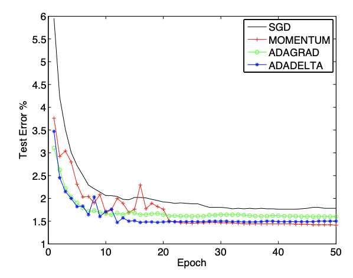

# ADADELTA: An Adaptive Learning Rate Method

Adadelta is a stochastic gradient-based optimization algorithm that allows for per-dimension learning rates. Adadelta is an extension of Adagrad that seeks to reduce its aggressive, monotonically decreasing learning rate. Instead of accumulating all past squared gradients, Adadelta restricts the window of accumulated past gradients to a fixed size . <a href="#citation1">[1]</a>

Instead of inefficiently storing  previous squared gradients, the sum of gradients is recursively defined as a decaying average of all past squared gradients. The running average  at time step  therefore only depends on the previous average and the current gradient <a href="#citation2">[2]</a>:

 is usually set to around 0.9. Rewriting SGD updates in terms of the parameter update vector:

AdaDelta takes the form:

For more information on how to derive this formula, take a look at '[An overview of gradient descent optimization algorithms](https://ruder.io/optimizing-gradient-descent/index.html#adadelta)' by [Sebastian Ruder](https://twitter.com/seb_ruder) and the [original Adadelta paper](https://arxiv.org/abs/1212.5701) by [Matthew D. Zeiler](https://arxiv.org/search/cs?searchtype=author&query=Zeiler%2C+M+D).

Adadelta's main advantages over Adagrad are that it doesn't need a default learning rate and that it doesn't decrease the learning rate as aggressively and monotonically as Adagrad. 

[1] Sebastian Ruder (2016). An overview of gradient descent optimization algorithms. arXiv preprint arXiv:1609.04747.

[2] <a href="https://paperswithcode.com/method/adadelta">https://paperswithcode.com/method/adadelta</a>

## Code

* [Adadelta Numpy Implementation](code/adadelta.py)