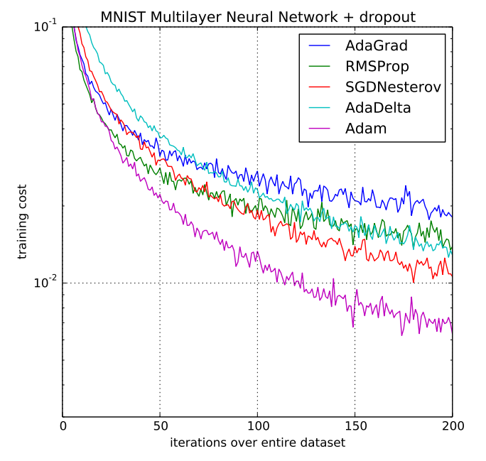

# Adaptive Moment Estimation (Adam)

Adaptive Moment Estimation better known as Adam is another adaptive learning rate method first published in 2014 by Kingma et. al. <a href="#citation1">[1]</a> In addition to storing an exponentially decaying average of past squared gradients $v_t$ like Adadelta or RMSprop, Adam also keeps an exponentially decaying average of past gradients $m_t$, similar to SGD with momentum. <a href="#citation2">[2]</a>

$$m_t = \beta_1 m_{t-1} + (1 - \beta_1) g_t$$

$$v_t = \beta_2 v_{t-1} + (1 - \beta_2) g_t^2$$

$m_t$ is an estimate of the first [moment](https://en.wikipedia.org/wiki/Moment_(mathematics)) (the mean) and $v_t$ is the estimate of the second moment (the uncentered variance) of the gradients respectively. As $m_t$ and $v_t$ are initialized as vectors of 0's, the authors of Adam observe that they are biased towards zero, especially during the initial time steps, and especially when the decay rates are small (i.e. $\beta_1$ and $\beta_2$ are close to 1). <a href="#citation2">[2]</a>

To counteract the biases by calculating bias-corrected first and second moment esimates:

$$\hat{m}_t = \dfrac{m_t}{1 - \beta^t_1}$$

$$\hat{v}_t = \dfrac{v_t}{1 - \beta^t_2}$$

$\hat{m}_t$ and $\hat{v}_t$ are then used to update the parameters as follows:

$$\theta_{t+1} = \theta_{t} - \dfrac{\eta}{\sqrt{\hat{v}_t} + \epsilon} \hat{m}_t$$

As default values for $\beta_1$ and $\beta_2$ the authors propose $0.9$ for $\beta_1$ and $0.999$ for $\beta_2$.

[1] Diederik P. Kingma and Jimmy Ba (2014). Adam: A Method for Stochastic Optimization.

[2] Sebastian Ruder (2016). An overview of gradient descent optimization algorithms. arXiv preprint arXiv:1609.04747.

## Code

- [Adam Numpy Implementation](code/adam.py)

## Resources

- [https://arxiv.org/abs/1412.6980](https://arxiv.org/abs/1412.6980)
- [https://ruder.io/optimizing-gradient-descent/index.html#adam](https://ruder.io/optimizing-gradient-descent/index.html#adam)
- [https://towardsdatascience.com/adam-latest-trends-in-deep-learning-optimization-6be9a291375c](https://towardsdatascience.com/adam-latest-trends-in-deep-learning-optimization-6be9a291375c)