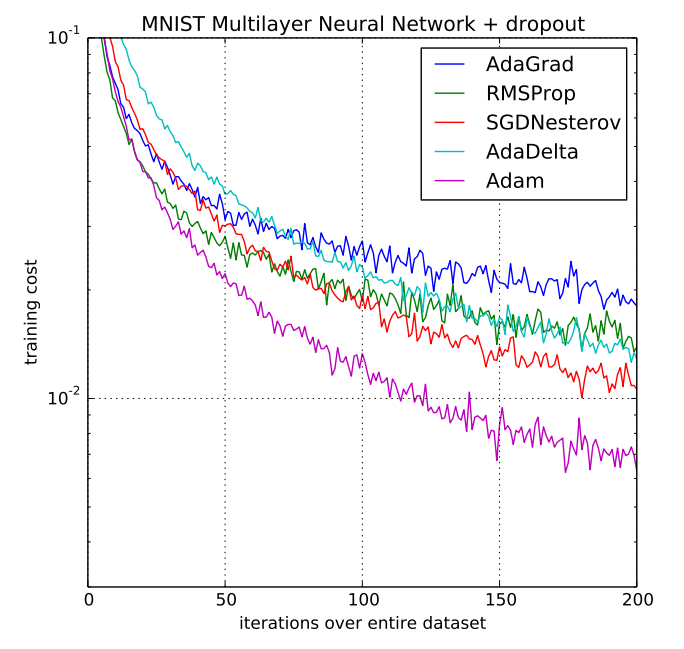

# AdaMax

In [Adam](https://ml-explained.com/blog/adam-explained), the update rule for individual weights is scaling their gradients inversely proportional to the  norm of the past and current gradients.

The L2 norm can be generalized to the  norm.

Such variants generally become numerically unstable for large , which is why  and  norms are most common in practice. However, in the special case where we let , a surprisingly simple and stable algorithm emerges.

To avoid confusion with Adam, we use  to denote the infinity norm-constrained :

We can now plug  into the Adam update equation replacing  to obtain the AdaMax update rule:

## Code

- [AdaMax Numpy Implementation](code/adamax.py)

## Resources

- [https://arxiv.org/abs/1412.6980](https://arxiv.org/abs/1412.6980)
- [https://ruder.io/optimizing-gradient-descent/index.html#adamax](https://ruder.io/optimizing-gradient-descent/index.html#adamax)
- [https://keras.io/api/optimizers/adamax/](https://keras.io/api/optimizers/adamax/)