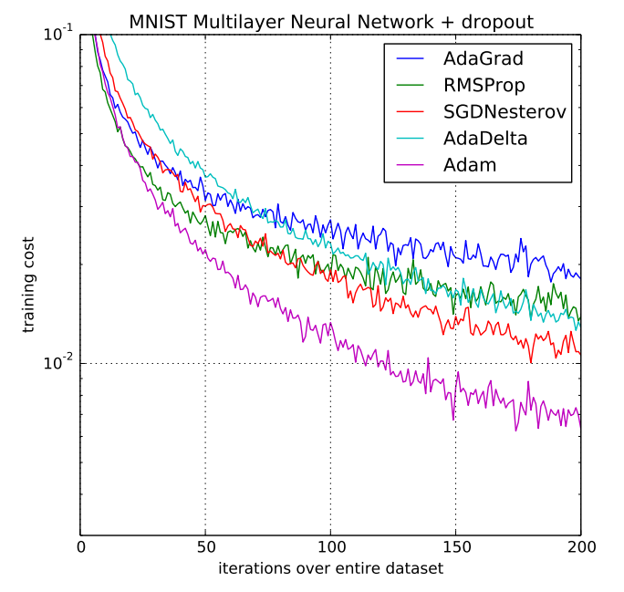

# AdaMax

In [Adam](https://ml-explained.com/blog/adam-explained), the update rule for individual weights is scaling their gradients inversely proportional to the $\ell_2$ norm of the past and current gradients.

$$v_t = \beta_2 v_{t-1} + (1 - \beta_2) |g_t|^2$$

The L2 norm can be generalized to the $\ell_p$ norm.

$$v_t = \beta_2^p v_{t-1} + (1 - \beta_2^p) |g_t|^p$$

Such variants generally become numerically unstable for large $p$, which is why $\ell_1$ and $\ell_2$ norms are most common in practice. However, in the special case where we let $p \rightarrow \infty$, a surprisingly simple and stable algorithm emerges.

To avoid confusion with Adam, we use $u_t$ to denote the infinity norm-constrained $v_t$:

$$
u_t = \beta_2^\infty v_{t-1} + (1 - \beta_2^\infty) |g_t|^\infty 
= \max(\beta_2 \cdot v_{t-1}, |g_t|) 
$$

We can now plug $u_t$ into the Adam update equation replacing $\sqrt{\hat{v}_t} + \epsilon$ to obtain the AdaMax update rule:

$$\theta_{t+1} = \theta_{t} - \dfrac{\eta}{u_t} \hat{m}_t$$

## Code

- [AdaMax Numpy Implementation](code/adamax.py)

## Resources

- [https://arxiv.org/abs/1412.6980](https://arxiv.org/abs/1412.6980)
- [https://ruder.io/optimizing-gradient-descent/index.html#adamax](https://ruder.io/optimizing-gradient-descent/index.html#adamax)
- [https://keras.io/api/optimizers/adamax/](https://keras.io/api/optimizers/adamax/)