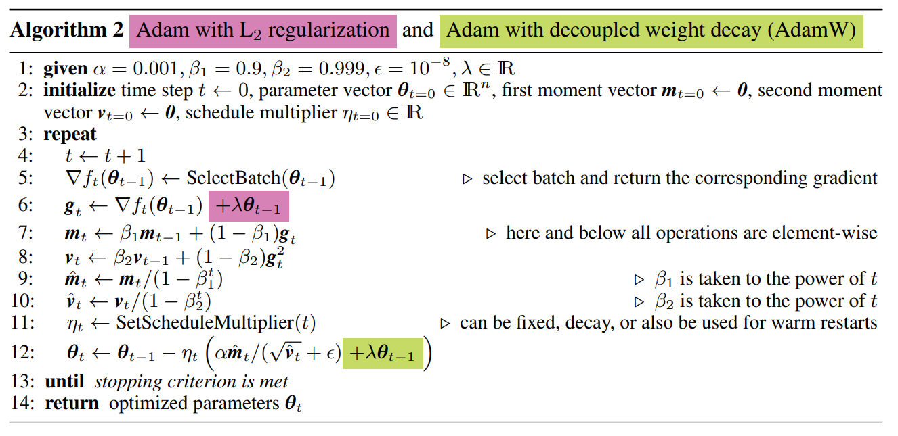

# AdamW

AdamW is a stochastic optimization method that modifies the typical implementation of weight decay in Adam to combat Adam's known convergence problems by decoupling the weight decay from the gradient updates.

## Code

- [AdamW Numpy Implementation](code/adamw.py)

## Resources

- [https://arxiv.org/abs/1711.05101](https://arxiv.org/abs/1711.05101)
- [https://paperswithcode.com/method/adamw](https://paperswithcode.com/method/adamw)
- [https://www.fast.ai/2018/07/02/adam-weight-decay/](https://www.fast.ai/2018/07/02/adam-weight-decay/)
- [https://towardsdatascience.com/why-adamw-matters-736223f31b5d](https://towardsdatascience.com/why-adamw-matters-736223f31b5d)
