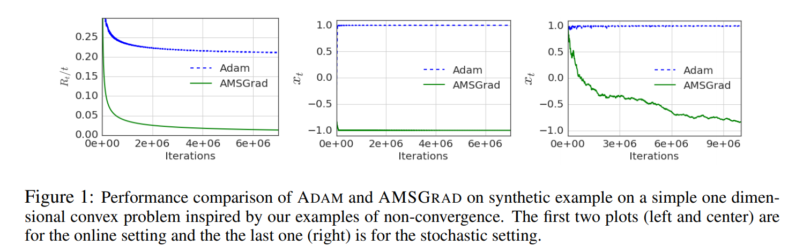

# AMSGrad

The motivation for AMSGrad lies with the observation that [Adam](https://ml-explained.com/blog/adam-explained) fails to converge to an optimal solution for some data-sets and is outperformed by SDG with momentum.

Reddi et al. (2018) <a href="#citation1">[1]</a> show that one cause of the issue described above is the use of the exponential moving average of the past squared gradients.

To fix the above-described behavior, the authors propose a new algorithm called AMSGrad that keeps a running maximum of the squared gradients instead of an exponential moving average.

$$v_t = \beta_2 v_{t-1} + (1 - \beta_2) g_t^2$$

$$\hat{v}_t = \text{max}(\hat{v}_{t-1}, v_t)$$

For simplicity, the authors also removed the debiasing step, which leads to the following update rule:

$$\begin{align} \begin{split} m_t &= \beta_1 m_{t-1} + (1 - \beta_1) g_t \\ v_t &= \beta_2 v_{t-1} + (1 - \beta_2) g_t^2\\ \hat{v}_t &= \text{max}(\hat{v}_{t-1}, v_t) \\ \theta_{t+1} &= \theta_{t} - \dfrac{\eta}{\sqrt{\hat{v}_t} + \epsilon} m_t \end{split} \end{align}$$

For more information, check out the paper '[On the Convergence of Adam and Beyond](https://arxiv.org/abs/1904.09237v1)' and the [AMSGrad section](https://ruder.io/optimizing-gradient-descent/index.html#amsgrad) of the '[An overview of gradient descent optimization algorithms](https://ruder.io/optimizing-gradient-descent/index.html)' article.

[1] Reddi, Sashank J., Kale, Satyen, & Kumar, Sanjiv. <a href="https://arxiv.org/abs/1904.09237v1">On the Convergence of Adam and Beyond</a>.

## Code

- [AMSGrad Numpy Implementation](code/amsgrad.py)

## Resources

- [https://arxiv.org/abs/1904.09237v1](https://arxiv.org/abs/1904.09237v1)
- [https://paperswithcode.com/method/amsgrad](https://paperswithcode.com/method/amsgrad)
- [https://ruder.io/optimizing-gradient-descent/index.html#amsgrad](https://ruder.io/optimizing-gradient-descent/index.html#amsgrad)
