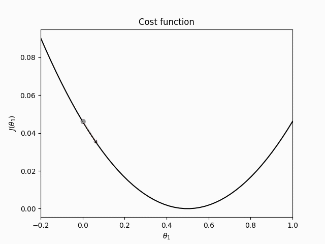
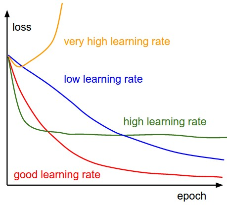
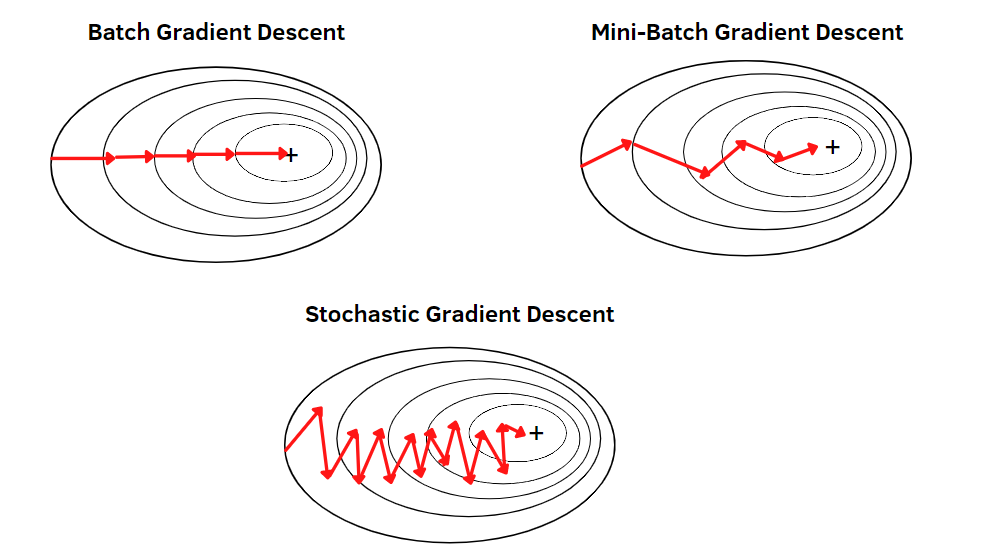
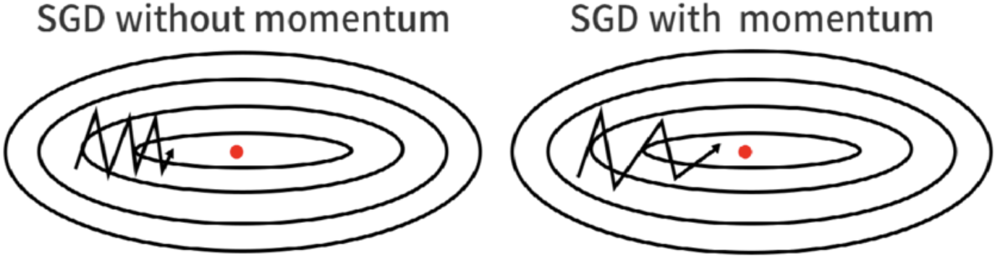
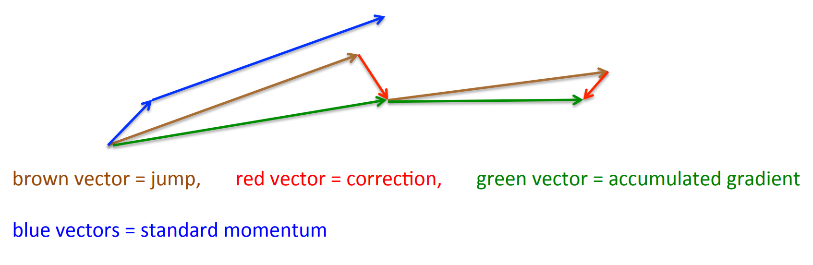

# Gradient Descent

Gradient descent is an optimization algorithm. Optimization refers to the task of minimizing/maximizing an objective function $J(\theta)$ parameterized by $\theta \in \mathbb{R}^d$. Gradient Descent minimizes the objective function $J(\theta)$ by iteratively moving in the direction of steepest descent as defined by the negative gradient of the objective function $-\nabla_\theta J(\theta)$ with respect to the parameters $\theta$. The size of the steps taken in the negative gradient direction is determined by the learning rate $\alpha$.

$$\theta := \theta - \alpha \cdot \nabla_\theta J( \theta)$$

Picking a proper value for the learning rate $\alpha$ is important as a too small learning rate can lead to slow convergence, while a too large learning rate can hinder convergence and cause the loss function to fluctuate around the minimum or even to diverge.

*Source: [CS231n Convolutional Neural Networks for Visual Recognition](https://cs231n.github.io/neural-networks-3/)*

## Gradient descent variants

There are three variants of gradient descent. They differ in the amount of data that is used to compute the gradient of the objective function. Depending on the amount of data, there is a trade-off between the accuracy of the parameter update (weight update) and the time it takes to perform an update.

### Batch gradient descent

Batch gradient descent computes the gradient of the objective function / cost function $J(\theta)$ with respect to the parameters $\theta$ on the entire training data-set.

$$\theta := \theta - \alpha \cdot \nabla_\theta J( \theta)$$

As all the gradients for the whole data-set need to be calculated to perform one single update, batch gradient descent can be very slow. Furthermore it can be impracticable for larger data-sets that don't fit into working memory. 

### Stochastic gradient descent (SGD)

Stochastic gradient descent (SGD), on the other hand, performs a parameter update for each training example $x^{(i)}$ and label $y^{(i)}$.

$$\theta := \theta - \alpha \cdot \nabla_\theta J( \theta; x^{(i)}; y^{(i)})$$

Batch gradient descent performs redundant gradient computations as it recomputes gradients for similar examples before performing a parameter update. SGD doesn't have the same redundancy as it updates for each training example, which is why it's usually much faster than batch gradient descend. Furthermore, it can also be used for online learning.

Performing a parameter update with only one training example can lead to high variance, which can cause the objective function to fluctuate.

### Mini-batch gradient descent

Mini-batch gradient descent combines the advantages of SGD and batch gradient descent by performing parameter updates for every mini-batch of $n$ training examples.

$$\theta := \theta - \alpha \cdot \nabla_\theta J( \theta; x^{(i:i+n)}; y^{(i:i+n)})$$

By performing the parameter update on a mini-batch, it **a)** reduces the variance of the update, which can lead to more stable convergence, and **b)** can make use of highly optimized matrix calculates commonly found in state-of-the-art deep learning libraries.

The mini-batch size usually ranges between 16 and 256 depending on the application and the training hardware. Mini-batch gradient descent is typically the algorithm of choice from the three ones discussed above.

*Source: [Understanding Optimization Algorithms](https://laptrinhx.com/understanding-optimization-algorithms-3818430905/)*

## Challenges

All three of the above-mentioned types of Gradient descent have a few challenges that need to be addressed:

- Choosing a proper learning rate can be difficult.
- The learning rate is the same throughout training.
- The same learning rate is applied to all parameter updates.
- Gradient Descent is a first-order optimization algorithm. Meaning that it only takes into account the first derivative of the objective function and not the second derivative, even though the curvature of the objective function also affects the size of each learning step.

## Momentum

Momentum is a method that helps accelerate SGD in the relevant direction and dampens oscillations by adding a fraction $\gamma$ of the last update vector $v_{t-1}$ to the current update vector.

$$v_t = \gamma v_{t-1} + \alpha \cdot \nabla_\theta J( \theta)$$

$$\theta = \theta - v_t $$

The momentum term increases for dimensions where gradients continuously point in the same directions and reduces the updates for dimensions whose gradients change directions from one time step to another. As a result, convergence is faster, and oscillation is reduced. 

*Source: [SGD with Momentum](https://paperswithcode.com/method/sgd-with-momentum)*

## Nesterov accelerated gradient

Nesterov accelerated gradient (NAG), also called Nesterov Momentum is a variation of momentum that approximates the next values of the parameters by computing $\theta - \gamma v_{t-1}$ and then takes the gradient of the objective funtion not w.r.t the current parameters $\theta$ but w.r.t the approximate future parameters $\theta - \gamma v_{t-1}$. 

$$v_t = \gamma v_{t-1} + \alpha \cdot \nabla_\theta J( \theta - \gamma v_{t-1} )$$ 

$$\theta = \theta - v_t$$

Momentum first computes the current gradient (small blue vector) and then takes a big jump in the direction of the updated accumulated gradient (big blue vector). NAG, on the other hand, first makes a big jump in the direction of the previous accumulated gradient (brown vector), measures the gradient, and then makes a correction (red vector), which results in the green vector. The anticipation prevents the update from overshooting and results in increased responsiveness. 

*Source: [G. Hinton's lecture 6c](http://www.cs.toronto.edu/~tijmen/csc321/slides/lecture_slides_lec6.pdf)*

## Code

- [Gradient Descent with momentum](code/gradient_descent_with_momentum.py)
- [Gradient descent with nesterov momentum](code/gradient_descent_with_nesterov_momentum.py)

## Resources

- [An overview of gradient descent optimization algorithms](https://ruder.io/optimizing-gradient-descent/)
- [Gradient Descent ML Glossary](https://ml-cheatsheet.readthedocs.io/en/latest/gradient_descent.html)
- [Gradient Descent Algorithm and Its Variants](https://towardsdatascience.com/gradient-descent-algorithm-and-its-variants-10f652806a3)
- [Gradient Descent, Step-by-Step](https://www.youtube.com/watch?v=sDv4f4s2SB8)
- [Stochastic Gradient Descent, Clearly Explained!!!](https://www.youtube.com/watch?v=vMh0zPT0tLI)
- [Gradient descent, how neural networks learn | Deep learning, chapter 2](https://www.youtube.com/watch?v=IHZwWFHWa-w)
- [Lecture 6a Overview of mini-batch gradient descent](http://www.cs.toronto.edu/~tijmen/csc321/slides/lecture_slides_lec6.pdf)