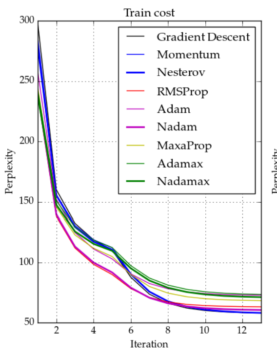

# Nadam (Nesterov-accelerated Adaptive Moment Estimation)

Nadam (Nesterov-accelerated Adaptive Moment Estimation) combines NAG (Nesterov accelerated gradient) and Adam. To do so, the momentum term  needs to be updated. For more information, check out [the paper](http://cs229.stanford.edu/proj2015/054_report.pdf) or the [Nadam section](https://ruder.io/optimizing-gradient-descent/index.html#nadam) of ['An overview of gradient descent optimization algorithms'](https://ruder.io/optimizing-gradient-descent/index.html).

The final update rule looks as follows:

## Code

- [Nadam Numpy Implementation](code/nadam.py)

## Resources

- [http://cs229.stanford.edu/proj2015/054_report.pdf](http://cs229.stanford.edu/proj2015/054_report.pdf)
- [https://paperswithcode.com/method/nadam](https://paperswithcode.com/method/nadam)
- [https://ruder.io/optimizing-gradient-descent/index.html#nadam](https://ruder.io/optimizing-gradient-descent/index.html#nadam)