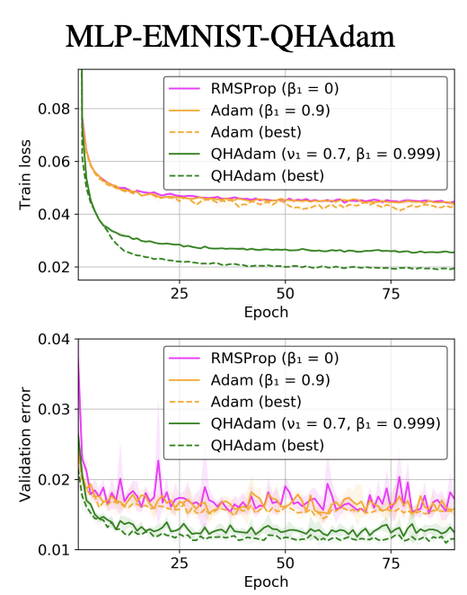

# QHAdam (Quasi-Hyperbolic Adam)

**Quasi-Hyperbolic Momentum Algorithm (QHM)** is a simple alteration of [SGD with momentum](https://paperswithcode.com/method/sgd-with-momentum), averaging a plain SGD step with a momentum step. **QHAdam (Quasi-Hyperbolic Adam)** is a QH augmented version of [Adam](https://ml-explained.com/blog/adam-explained) that replaces both of Adam's moment estimators with quasi-hyperbolic terms. Namely, QHAdam decouples the momentum term from the current gradient when updating the weights, and decouples the mean squared gradients term from the current squared gradient when updating the weights. [<a href="#citation1">1</a>, <a href="#citation2">2</a>, <a href="#citation3">3</a>]

Essentially, it's a weighted average of the momentum and plain SGD, weighting the current gradient with an immediate discount factor  divided by a weighted average of the mean squared gradients and the current squared gradient, weighting the current squared gradient with an immediate discount factor . <a href="#citation2">[2]</a>

[1] Ma, J. and Yarats, D. Quasi-hyperbolic momentum and Adam for deep learning. arXiv preprint arXiv:1810.06801, 2018

[2] <a href="https://paperswithcode.com/method/qhadam">QHAdam Papers With Code</a>

[3] John Chen. <a href="https://johnchenresearch.github.io/demon/">An updated overview of recent gradient descent algorithms</a>

## Code

- [QHAdam Numpy Implementation](code/qhadam.py)