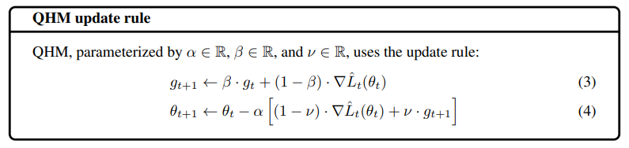

# QHM (Quasi-Hyperbolic Momentum)

Quasi-Hyperbolic Momentum Algorithm (QHM) is a simple alteration of SGD with momentum, averaging a plain SGD step with a momentum step, thereby decoupling the momentum term  from the current gradient  when updating the weights.

The authors recommend  and  as a good starting point. For more information about QHM, check out the resources below.

## Code

- [QHM Numpy Implementation](code/qhm.py)

## Resources

- [https://arxiv.org/pdf/1810.06801.pdf](https://arxiv.org/pdf/1810.06801.pdf)
- [https://paperswithcode.com/method/qhadam](https://paperswithcode.com/method/qhadam)
- [https://johnchenresearch.github.io/demon/](https://johnchenresearch.github.io/demon/)
- [https://facebookresearch.github.io/qhoptim/](https://facebookresearch.github.io/qhoptim/)