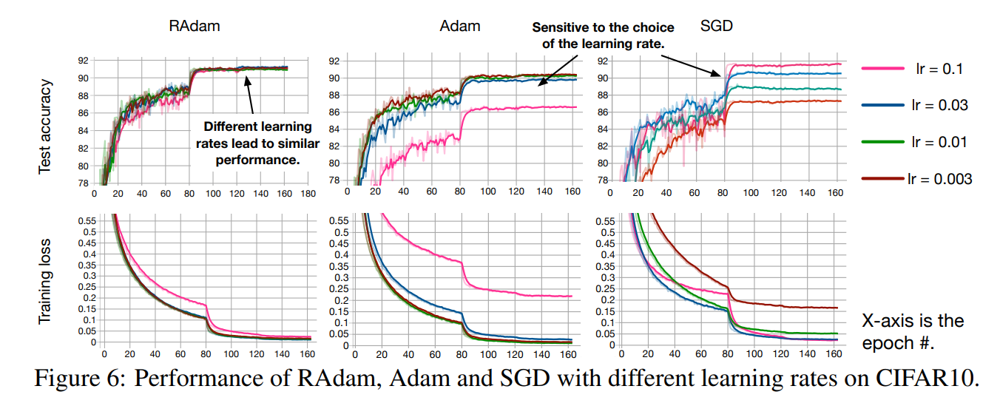
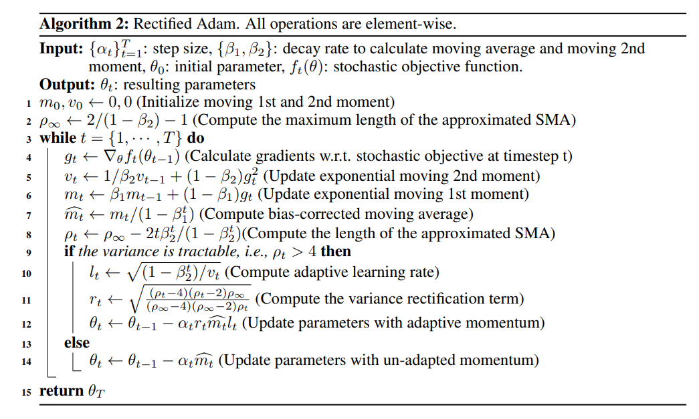

# RAdam - Rectified Adam

RAdam or "Rectified Adam" is a variant of the Adam optimizer that seeks to tackle Adam's bad convergence problem by introducing a term to rectify the variance of the adaptive learning rate.

The authors argue that the root cause of Adam's bad convergence is that the adaptive learning rate has an undesirable large variance in the early stage of model training due to the limited amount of training samples being used.

RAdam deals with the large variance of the adaptive learning rate by adding a rectifier term:

## Code

- [RAdam Numpy Implementation](code/radam.py)

## Resources

- [https://arxiv.org/abs/1908.03265](https://arxiv.org/abs/1908.03265)
- [https://paperswithcode.com/method/radam](https://paperswithcode.com/method/radam)
- [https://github.com/LiyuanLucasLiu/RAdam](https://github.com/LiyuanLucasLiu/RAdam)
- [https://lessw.medium.com/new-state-of-the-art-ai-optimizer-rectified-adam-radam-5d854730807b](https://lessw.medium.com/new-state-of-the-art-ai-optimizer-rectified-adam-radam-5d854730807b)
