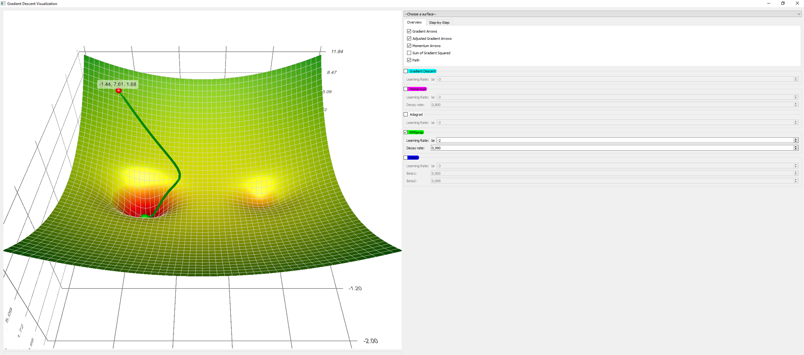

# RMSprop

RMSprop is an unpublished, adaptive learning rate optimization algorithm first proposed by [Geoff Hinton](https://en.wikipedia.org/wiki/Geoffrey_Hinton) in lecture 6 of his online class "[Neural Networks for Machine Learning](http://www.cs.toronto.edu/~hinton/coursera/lecture6/lec6.pdf)". RMSprop and Adadelta have been developed independently around the same time, and both try to resolve Adagrad's diminishing learning rate problem. <a href="#citation1">[1]</a>

The difference between Adadelta and RMSprop is that Adadelta removes the learning rate  entirely and replaces it by the root mean squared error of parameter updates.

[1] Sebastian Ruder (2016). An overview of gradient descent optimization algorithms. arXiv preprint arXiv:1609.04747.

## Code

* [RMSprop Numpy Implementation](code/rmsprop.py)