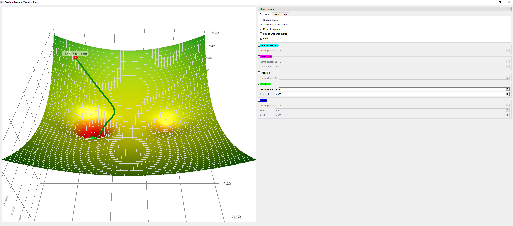

# RMSprop

RMSprop is an unpublished, adaptive learning rate optimization algorithm first proposed by [Geoff Hinton](https://en.wikipedia.org/wiki/Geoffrey_Hinton) in lecture 6 of his online class "[Neural Networks for Machine Learning](http://www.cs.toronto.edu/~hinton/coursera/lecture6/lec6.pdf)". RMSprop and Adadelta have been developed independently around the same time, and both try to resolve Adagrad's diminishing learning rate problem. <a href="#citation1">[1]</a>

$$\begin{align} 
\begin{split} 
E[g^2]_t &= 0.9 E[g^2]_{t-1} + 0.1 g^2_t \\ 
\theta_{t+1} &= \theta_{t} - \dfrac{\eta}{\sqrt{E[g^2]_t + \epsilon}} g_{t} 
\end{split} 
\end{align}$$

The difference between Adadelta and RMSprop is that Adadelta removes the learning rate $\eta$ entirely and replaces it by the root mean squared error of parameter updates.

[1] Sebastian Ruder (2016). An overview of gradient descent optimization algorithms. arXiv preprint arXiv:1609.04747.

## Code

* [RMSprop Numpy Implementation](code/rmsprop.py)